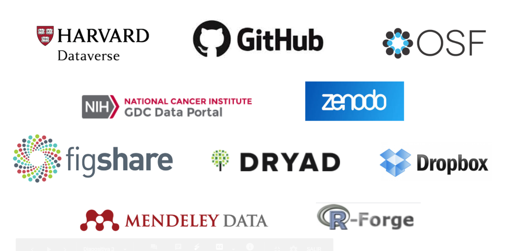
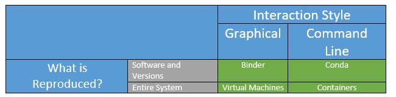

```{r setup, include=FALSE}
options(htmltools.dir.version = FALSE)
```

```{r xaringan-themer, include=FALSE, warning=FALSE}
library(xaringanthemer)
library(xaringanExtra)
library(tidyverse)
library(knitr)
library(icon)
library(kableExtra)
library(nomnoml)
xaringanExtra::use_logo(
  image_url = "https://raw.githubusercontent.com/rstudio/hex-stickers/master/PNG/xaringan.png"
)
xaringanExtra::use_panelset()
xaringanExtra::use_broadcast()
xaringanExtra::use_share_again()
xaringanExtra::style_share_again(share_buttons = c("twitter", "linkedin"))
xaringanExtra::use_tachyons()
xaringanExtra::use_fit_screen()
xaringanExtra::use_tile_view() # O
style_mono_accent(
  base_color = "#0dc96f",
  background_color = "#ffffff",
  inverse_background_color = "#562457",
  header_color = "#562457",
  inverse_header_color = "#ffffff", 
  inverse_text_color = "#ffffff",
  code_inline_color = "#179c55",
  link_color= "#A406B2",
  text_font_size = "25px",
  header_font_google = google_font("Roboto", "Medium", "500"), #Popper
  text_font_google   = google_font("Lora", "Regular", "400"),
  code_font_google   = google_font("Fira Mono"),
  )
```

```{r metathis, echo=FALSE}
library(metathis)
meta() %>%
  meta_name("github-repo" = "flor14/rladies-jujuy") %>% 
  meta_social(
    title = "Toronto Data Workshop on Reproducibility",
    description = paste(
      "Choose your own adventure to a reproducible scientific article:", 
      "learnings from ReproHack"
    ),
    url = "https://flor14.github.io/rladies-jujuy/presentacion.html?panelset=licencia#1",
    image = "https://res.cloudinary.com/flor/image/upload/v1608248822/jujuy-colores_frmvax.jpg",
    image_alt = paste(
      "Florencia D'Andrea",
      "February 2021"
      ),
    og_type = "website",
    og_author = "Florencia D'Andrea",
    twitter_card_type = "summary_large_image",
    twitter_creator = "@cantoflor_87",
    twitter_site = "@cantoflor_87"
  )
```

background-image: url(imagenes/75581.jpg)
background-size: cover
class: bottom


.bg-washed-green.b--dark-green.ba.bw2.br3.shadow-5.ph4.mt5[
## Choose your own adventure to a reproducible scientific article
### **learnings from ReproHack**

Florencia D'Andrea
.large[Toronto Data Workshop on Reproducibility | Feb 2021 ]
]

---

background-image: url(imagenes/75581.jpg)
background-size: cover
class: center


.bg-washed-green.b--dark-green.ba.bw2.br3.shadow-5.ph4.mt5[


**Link to the slides**: [bit.ly/florencia_toronto](bit.ly/florencia_toronto)

]


.footnote[[Cover image from: rawpixel.com - www.freepik.es](www.freepik.es)]


---
class: center
Researchers are sharing their code and data

```{r open_research, echo = FALSE, out.width=700, fig.align = "center"}
knitr::include_graphics("imagenes/openresearch.jpg")
```
.footnote[[The Turing Way Community, & Scriberia. (2020)](http://doi.org/10.5281/zenodo.3695300)]

---

class: middle, center

```{r circulo, echo = FALSE, out.width=250, fig.align = "center"}
knitr::include_graphics("imagenes/circulo.png")
```
## More articles with published code and data are accessible and **could be reproduced by everyone**


---

## Reproducibility is consider a proof of **Research Quality**...

.pull-up[
```{r cd, echo=FALSE, out.width=400, fig.align='center'}
knitr::include_graphics("imagenes/codecheck.png")
```
.footnote[[Codecheck WebPage](https://www.nature.com/articles/d41586-020-02462-7)]
 ]
 
.pull-down[
```{r cd2, echo=FALSE, out.width=700, fig.align='center'}
knitr::include_graphics("imagenes/codecheck2.png")
```
]


---
 
 
 
## ... even if it is not the only one


.bg-washed-green.b--dark-green.ba.bw2.br3.shadow-5.ph4.mt5[

 "The fact that an analysis is reproducible does not guarantee the quality, correctness, or validity of the published results."

]


.footnote[[Peng *et al.* (2011)](https://science.sciencemag.org/content/334/6060/1226) ]
 

---

## The scientific community should learn about **reproducible practises**


.pull-left[

Make it easy to share their work 

It will last more time


]

.pull-right[


```{r tools, echo = FALSE, out.width=600}
knitr::include_graphics("imagenes/researchtools.jpg")
```

]


.footnote[[The Turing Way Community, & Scriberia. (2020)](http://doi.org/10.5281/zenodo.3695300)]
---
class: middle, center

## ¿Are we living a cultural **change**?

.pull-left[
<blockquote class="twitter-tweet" data-lang="ens"><p lang="en" dir="ltr">The advert asks for: 
"A commitment to following the best [..] practices in science, such as [..] sharing of computer code and writing reproducible research reports, [..]sharing of data whenever feasible"

Have you come across job descriptions asking for such a commitment before?</p>&mdash; ReproHack(@ReproHack) <a href="https://twitter.com/ReproHack/status/1296061566484385792?s=20">19 August 2020</a></blockquote>
]

.pull-right[

The advert asks for: 
"A commitment to following the best [..] practices in science, such as [..] sharing of computer code and writing reproducible research reports, [..]sharing of data whenever feasible"

**Have you come across job descriptions asking for such a commitment before?**

]

.footnote[[ReproHack Twitter](https://twitter.com/ReproHack)]


---


---

class: center, middle, inverse

## **ReproHack**
Learning from the experience


```{r rhack, echo = FALSE, out.width=150}
knitr::include_graphics("imagenes/reprohack.png")
```


---


## Hackathon
### Authors 


Send their papers with **publicly available associated code and data**

```{r circulo2, echo = FALSE, out.width=500, fig.align = "center"}
knitr::include_graphics("imagenes/circulo.png")
```


---

## Hackathon
### Participants

Attempt to **reproduce published research** of their choice from a list of proposed 

```{r sub_form, echo = FALSE, out.width=500, fig.align = "center"}
knitr::include_graphics("imagenes/selecciona.png")
```


---

## Authors 

article + code + data 


```{r sub_form3, echo = FALSE, out.width=700, fig.align = "center"}
knitr::include_graphics("imagenes/submited.png")
```


.footnote[Thanks [Luis Verde](https://twitter.com/LuisDVerde)!]

---

---

## How data and code is shared?

```{r sub_form2, echo = FALSE, out.width=700,fig.align = "center"}
knitr::include_graphics("imagenes/submited2.png")
```


---

### This link led us to...

You should give clear instructions to the reviewers on how to access the material to reproduce no matter where it is stored 


```{r collage, echo = FALSE, out.width=800}

```


.footnote[Some resources about repositories [here]()]

---

class: inverse, center, middle


## 📄

## **Readme**

Guide the reviewer to your results


---

## What a **readme** should have?

* General information

* Data and file overview

--

* Sharing and access information

* Methodological information

--

### **Is all of this information necessary to reproduce the article?**

--

.footnote[[Guide to writing "readme" style metadata - RESEARCH DATA MANAGEMENT SERVICE GROUP - Cornell University](https://data.research.cornell.edu/content/readme)]


---

class: inverse, middle, center

## 🧭

### What do we need?

Reading a license will not give us the steps we must take to reproduce the article.


---

## Explain the HOW

Categorizing the Content of GitHub README Files

```{r catego, echo = FALSE, out.width=500}

kableExtra::kbl(data.frame(Category = c("What", "Why", "How", "When", "Who", "References", "Contribution", "Other"),
           Example_section_headings = c("Introduction, project, background",
                                        "Advantages of the project, comparison with related work",
                                        "Getting started, how to run, installation, how to update, configuration, languages, dependencies,...",
                                        "Project status, versions, roadmap,...",
                                        "Project team, community, contact,...",
                                        "feedback, getting support, more information",
                                        "Contribution guidelines", " ") )) %>% 
    kable_minimal() %>% 
  row_spec(3, bold = T, color = "white", background = "#D7261E")


# 
```

.footnote[[Prana *et al.* (2019)](https://link.springer.com/article/10.1007/s10664-018-9660-3#citeas)]


---

## As researchers, we know how a manuscript is organized

```{r paper, echo = FALSE, out.width=800}
knitr::include_graphics("imagenes/paper_luis.png")
```

---

class: inverse, center, middle

## How **code** and **data** could be organised?

---
## Research Compendium

.pull-left[

1. **Organize files** according to a prevailing convention.

2. Provide **separation between data, methods and results** expressing unambiguously the relationship between the three.

3. Specify the environment (+ **reproducibility**).


]

.pull-right[
```{r rc2, echo = FALSE, out.width=500}
knitr::include_graphics("imagenes/ResearchCompendium.jpg")
```
]

.footnote[[Marwick *et al.* (2018)](https://doi.org/10.1080/00031305.2017.1375986)]

---

## **Research Compendium** 
### 1. **Organize files** according to a prevailing convention.


```{r rc3, echo = FALSE, out.width=500, fig.align='center'}
knitr::include_graphics("imagenes/compendio1.png")
```
.footnote[[Marwick *et al.* (2018)](https://doi.org/10.1080/00031305.2017.1375986)]
---

## What I find useful to reproduce the article results? 

A clear and detailed description of the files/links necessary and where they are


```{r ej1, echo = FALSE, out.width=300}
knitr::include_graphics("imagenes/estructura.png")
```

```{r ej2, echo = FALSE, out.width=300}
knitr::include_graphics("imagenes/estructura.png")
```

---

##  `rrtools` Package
#### Research compendiums in R

```{r rclogo, echo = FALSE, out.width=100, fig.align ='center'}

```


.bg-washed-green.b--dark-green.ba.bw2.br3.shadow-5.ph4.mt5[
[`rrtools`](https://github.com/benmarwick/rrtools) proporciona instrucciones, plantillas y funciones para hacer un compendio básico adecuado para escribir **investigaciones reproducibles con R**.]

.footnote[[Marwick *et al.* (2018)](https://doi.org/10.1080/00031305.2017.1375986)]

---
### **research compendium** 3. Specify the environment (+ **reproducibility**).
##### Computational environment

Characteristics of a computer that can affect the behavior of the work done on it, such as:

* your **operating system**

* what **software** do you have installed

* the software **package versions** installed

.footnote[[The Turing Way: A Handbook for Reproducible Data Science (2019)](https://the-turing-way.netlify.app/)]

---

class: inverse, middle, center

### The way the computational environment is captured will change the experience of reproducing the article


.footnote[[HOW (AND WHY) TO MAKE A RESEARCH COMPENDIUM - Dr. Max Joseph ](https://mbjoseph.github.io/intro-research-compendia/#1)]

---

## As author I want to ensure the reproducibility of my work

class: center, middle


```{nomnoml echo=FALSE, svg= TRUE, fig.width = 10, fig.align = "center"}
# direction: down | center 
#.resaltado: fill=#8f8 title=bold
[Reproducibilidad] -> [Empírica]
[Reproducibilidad] -> [<resaltado> Computacional]
[Reproducibilidad] -> [Estadística]
```


.bg-washed-green.b--dark-green.ba.bw2.br3.shadow-5.ph4.mt5[
**Computational reproducibility**

When detailed information is provided about code, software, hardware and implementation details. ]

.footnote[[Stodden (2014)](https://www.edge.org/response-detail/25340)]


---

## Capture the computational environment

## 📄

> "At its most basic, this could be a plain text file that includes a short list of the names and version numbers of the software and other critical tools used for the analysis." 


.footnote[Marwick *et al.* (2018)](https://doi.org/10.1080/00031305.2017.1375986)]

---

**A.** Provide **detailed description** of dependencies and software/hardware used

**B.** Describe how to **install** requiered software

**C.** Share a **link**

---

#### **A.** Provide **detailed description** of dependencies and software/hardware used

** Hackathon participant experience** `r icon::fontawesome("star", style = "solid")``r icon::fontawesome("star")``r icon::fontawesome("star")`

👩‍💻
> *"It is better than nothing, I guess"*

```{r sessioninfo, echo = FALSE, out.width=500}
knitr::include_graphics("imagenes/sessioninfo.png")
```


---

## **B.** How to **Install** software

example: Install Docker

**Hackathon participant experience** `r icon::fontawesome("star", style = "solid")``r icon::fontawesome("star", style = "solid")``r icon::fontawesome("star")`

☕ 
> *"Time for a coffe"*

```{r docker, echo = FALSE, out.width=500}
knitr::include_graphics("imagenes/docker.png")
```


---

## **C.** Sharing a **link** 

example: Binder

** Hackathon participant experience** `r icon::fontawesome("star", style = "solid")``r icon::fontawesome("star", style = "solid")``r icon::fontawesome("star", style = "solid")`


😎
> *"So, I click a link and I get the results?"*

```{r binder, echo = FALSE, out.width=500}
knitr::include_graphics("imagenes/ResearchCompendium.jpg")
```

---

class: inverse, center, middle, 

## ☁💻☁
### Binder’s goal is to lower the barrier to interactivity, and to allow users to utilize code that is hosted in repository providers such as GitHub

.footnote[[Binder 2.0 - Reproducible, interactive, sharable environments for science at scale](https://pdfs.semanticscholar.org/c043/bef741a9616d1144e0205ac21ceae881485d.pdf)]


---


```{r echo = FALSE}
knitr::include_graphics("imagenes/binder.png")
```


Binder is an open source web service that lets users create sharable, interactive, reproducible environments in the cloud.


---
## The dark side of the links

What happens when the technology fails? Should we provide other options?

```{r notfound, echo = FALSE}
knitr::include_graphics("imagenes/links.png")
```


---
## Environments

```{r env, echo = FALSE, out.width=800, fig.align='center'}

kableExtra::kbl(data.frame(uno = c("", "", "What is reproduced?"),
           dos = c("",  "Software and versions", "Entire system"),
           Graphical = c("", "Binder", "Virtual Machines"),
           `Command line` = c("",  "Conda", "Containers"))) %>% 
  kable_classic() %>%
  add_header_above(c(" " = 2,  "Interaction style" = 2)) %>% 
  collapse_rows(columns = 1, valign = "top")


```


.footnote[[*Recreated from* The Turing Way: A Handbook for Reproducible Data Science  (2019)](https://the-turing-way.netlify.app/reproducible-research/renv/renv-options.html)]


---

class: middle, inverse, center
### Did you ever consider that your next scientific article can have not only readers but also **users**?

---

## Documentation

The more detailed the documentation, the easier it will be for someone who does not know about the technologies used in the article to reproduce it

---

# **{**Definition**}**
### Research software

.bg-washed-green.b--dark-green.ba.bw2.br3.shadow-5.ph4.mt5[
#### Software that is used to generate, process or analyse results that you intend to appear in a publication (either in a journal, conference paper, monograph, book or thesis).

#### Research software can be anything from a few lines of code written by yourself, to a professionally developed software package]

.footnote[[Hettrick *et al.* (2014)](https://doi.org/10.5281/zenodo.608046)]


---

### ReproHack **feedback form**

* Reproducibility ✅

* Reusability ✅

* Documentation ✅

* Transparency ✅


---

## This is a lot of work!

```{r repro, echo = FALSE, fig.align='right'}
knitr::include_graphics("imagenes/CultureShift.jpg")
```

.footnote[[The Turing Way Community, & Scriberia. (2020)]( http://doi.org/10.5281/zenodo.3695300)]]


---

class: inverse, middle, center


---
class: middle, center
# Join us!

```{r rh3, echo = FALSE, out.width=200, fig.align='center'}
knitr::include_graphics("imagenes/reprohack.png")
```

[Twitter](https://twitter.com/ReproHack)

[Slack](https://reprohack-autoinvite.herokuapp.com/)

[Email](reprohack.team@gmail.com)


---

# ReproHack in [LatinR 2020](https://latin-r.com/blog/reprohack)

[Playlist with 6 talks on reproducibility in Spanish](https://www.youtube.com/playlist?list=PL9-E3cL2KgKliN3DFBWfUAUNXco_NOAMQ)

```{r rhlr, echo=FALSE}
xaringanExtra::embed_xaringan(url = "https://flor14.github.io/latinr-reprohack/index.html#1")
```

---

# Ana Krystalli's talk in UseR! 2020

[Video](https://www.youtube.com/watch?v=KHMW8fV2NXo)

```{r rh, echo = FALSE, out.width=700, fig.align='center'}
knitr::include_graphics("imagenes/anna.png")
```


---
class: middle, inverse, center
## Thanks to ReproHack **Team**!

Anna Krystalli <br> 
Daniela <br> 
Linda <br> 
Riccarda <br> 
Paloma Rojas-Saunero <br> 
Florencia D'Andrea


---

class: inverse, center, middle

## References

---
background-image:  url(imagenes/75581.jpg)
background-size: cover

.bg-washed-green.b--dark-green.ba.bw2.br3.shadow-5.ph4.mt5[

**README**

* Prana, G.A.A., Treude, C., Thung, F. et al. (2019) [Categorizing the Content of GitHub README Files.](https://link.springer.com/article/10.1007/s10664-018-9660-3#citeas) Empir Software Eng 24, 1296–1327 https://doi.org/10.1007/s10664-018-9660-3

* Wilkinson, M., Dumontier, M., Aalbersberg, I. et al. The FAIR Guiding Principles for scientific data management and stewardship. Sci Data 3, 160018 (2016). https://doi.org/10.1038/sdata.2016.18

* Kryvokhyzha D. () [The best free Research Data Repository](https://evodify.com/free-research-repository/)
]

---

background-image: url(imagenes/75581.jpg)
background-size: cover

.bg-washed-green.b--dark-green.ba.bw2.br3.shadow-5.ph4.mt5[
* Katz DS, Niemeyer KE, Smith AM, Anderson WL, Boettiger C, Hinsen K, Hooft R, Hucka M, Lee A, Löffler F, Pollard T, Rios F. 2016. [Software vs. data in the context of citation. PeerJ Preprints 4]( https://doi.org/10.7287/peerj.preprints.2630v1)

* Lamprecht, A. L., Garcia, L., Kuzak, M., Martinez, C., Arcila, R., Martin Del Pico, E., ... & McQuilton, P. (2020). Towards FAIR principles for research software. Data Science, 3(1), 37-59.

* [Library Carpentry: FAIR Data and Software](https://librarycarpentry.org/lc-fair-research/)


]

---

background-image: url(imagenes/75581.jpg)
background-size: cover

.bg-washed-green.b--dark-green.ba.bw2.br3.shadow-5.ph4.mt5[

**Reproducible Research / Open Science**

* GitBook Bot, Lambert Heller, datawomanHUB, mcancellieri, Bianca Kramer, Tony Ross-Hellauer, … Jon Tennant. (2018, April 4). [Open Science Training Handbook (Version 1.1)](https://book.fosteropenscience.eu/en/). Zenodo. http://doi.org/10.5281/zenodo.1212538

* Marwick, B., Boettiger, C., & Mullen, L. (2018). [Packaging data analytical work reproducibly using R (and friends). The American Statistician 72(1), 80-88.](https://doi.org/10.1080/00031305.2017.1375986)

* [OECD (2015), “Making Open Science a Reality”](https://www.fct.pt/dsi/docs/Making_Open_Science_a_Reality.pdf), OECD Science, Technology and Industry Policy Papers, No. 25,
OECD Publishing, Paris. http://dx.doi.org/10.1787/5jrs2f963zs1-en

* Peng RD (2011), [Reproducible Research in Computational Science. Science 334(6060): 1226–1227](doi:10.1126/science.1213847)

* Stodden, V. (2014). [Online; accessed 27. May 2020]. URL: https://www.edge.org/response-detail/25340.

* The Turing Way Community, Becky Arnold, Louise Bowler, Sarah Gibson, Patricia Herterich, Rosie Higman, … Kirstie Whitaker. (2019, March 25). [The Turing Way: A Handbook for Reproducible Data Science (Version v0.0.4). Zenodo. http://doi.org/10.5281/zenodo.3233986](https://the-turing-way.netlify.app/)

]

---
background-image:  url(imagenes/75581.jpg)
background-size: cover

.bg-washed-green.b--dark-green.ba.bw2.br3.shadow-5.ph4.mt5[

* Stodden, V. (2014). [Online; accessed 27. May 2020]. URL: https://www.edge.org/response-detail/25340.

* Wilkinson, M., Dumontier, M., Aalbersberg, I. et al. The FAIR Guiding Principles for scientific data management and stewardship. Sci Data 3, 160018 (2016). https://doi.org/10.1038/sdata.2016.18

* [Webpage Principios FAIR](https://www.go-fair.org/fair-principles/)

* Wickham, H. (2015). [R packages: organize, test, document, and share your code."](https://r-pkgs.org/index.html) O'Reilly Media, Inc."
]
---
background-image: url(imagenes/75581.jpg)
background-size: cover

.bg-washed-green.b--dark-green.ba.bw2.br3.shadow-5.ph4.mt5[
#### Herramientas en R / Charlas

* [Writing articles and reproducible documents R - Anna Quaglieri](https://rpubs.com/annaquagli/471405)

* [Reproducible Environments - RStudio](https://environments.rstudio.com/)

* [renv: Project Environments with R - RStudio blog](https://blog.rstudio.com/2019/11/06/renv-project-environments-for-r/)

* [Putting the R into Reproducible Research - Anna Krystalli](https://annakrystalli.me/talks/r-in-repro-research.html#1)

* [Improve your workflow for reproducible science - Mine Çetinkaya-Rundel](https://mine-cetinkaya-rundel.github.io/improve-repro-workflow-reproducibilitea-2020/slides/improve-repro-workflow-reproducibilitea-2020.pdf) ]

---
background-image:  url(imagenes/75581.jpg)
background-size: cover


.bg-washed-green.b--dark-green.ba.bw2.br3.shadow-5.ph4.mt5[

#### Illustrations

* The Turing Way Community, & Scriberia. (2020, March 3). Illustrations from the Turing Way book dashes. Zenodo. http://doi.org/10.5281/zenodo.3695300

]


---
class: center, middle

## Thank you!

.pull-left[
#### Dr. Florencia D'Andrea 
**Postdoctoral Researcher**<br> 


`r icon::fontawesome("twitter")` [@cantoflor_87]("http://twitter.com/cantoflor_87")<br>
`r icon::fontawesome("link")` [florencia.netlify.app/es-es/]("https://florencia.netlify.app/es-es/")
]

.pull-right[ 
```{r foto, echo = FALSE, out.width=250}
knitr::include_graphics("https://res.cloudinary.com/flor/image/upload/v1608466115/template_primary_wahkz0.jpg")
```
]


---

class: center, middle

### Licencia

<a rel="license" href="http://creativecommons.org/licenses/by/4.0/"></a><br />Este obra está bajo una <a rel="license" href="http://creativecommons.org/licenses/by/4.0/">licencia de Creative Commons Reconocimiento 4.0 Internacional</a>

---
background-image:  url(imagenes/75581.jpg)
background-size: cover


---
