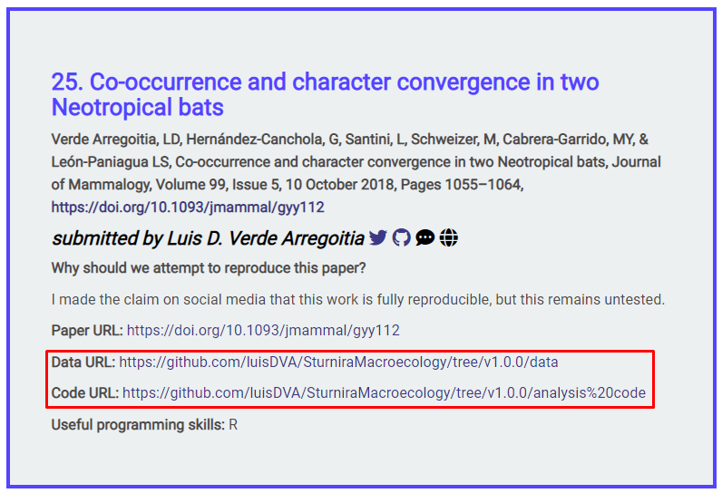
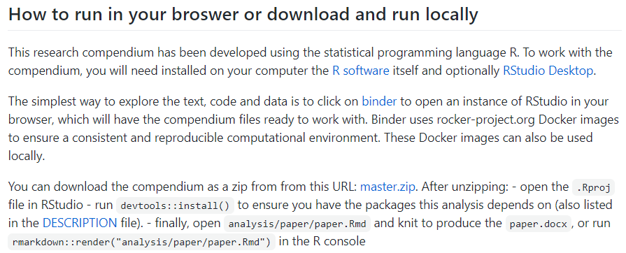
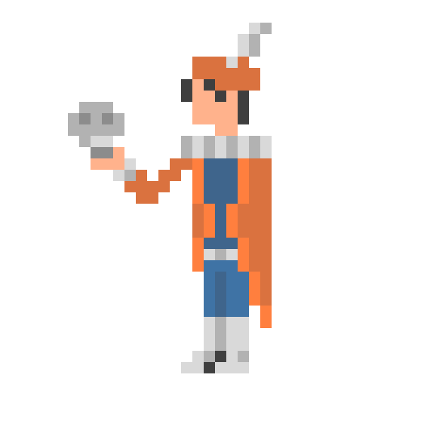

```{r setup, include=FALSE}
options(htmltools.dir.version = FALSE)
```

```{r xaringan-themer, include=FALSE, warning=FALSE}
library(xaringanthemer)
library(xaringanExtra)
library(tidyverse)
library(knitr)
library(icon)
library(nomnoml)
xaringanExtra::use_logo(
  image_url = "https://raw.githubusercontent.com/rstudio/hex-stickers/master/PNG/xaringan.png"
)
xaringanExtra::use_panelset()
xaringanExtra::use_broadcast()
xaringanExtra::use_share_again()
xaringanExtra::style_share_again(share_buttons = c("twitter", "linkedin"))
xaringanExtra::use_tachyons()
xaringanExtra::use_fit_screen()
xaringanExtra::use_tile_view() # O
style_mono_accent(
  base_color = "#0dc96f",
  background_color = "#ffffff",
  inverse_background_color = "#562457",
  header_color = "#562457",
  inverse_header_color = "#ffffff", 
  inverse_text_color = "#ffffff",
  code_inline_color = "#179c55",
  link_color= "#A406B2",
  text_font_size = "25px",
  header_font_google = google_font("Roboto", "Medium", "500"), #Popper
  text_font_google   = google_font("Lora", "Regular", "400"),
  code_font_google   = google_font("Fira Mono"),
  )
```

```{r metathis, echo=FALSE}
library(metathis)
meta() %>%
  meta_name("github-repo" = "flor14/rladies-jujuy") %>% 
  meta_social(
    title = "Toronto Data Workshop on Reproducibility",
    description = paste(
      "Choose your own adventure to a reproducible scientific article:", 
      "learnings from ReproHack"
    ),
    url = "https://flor14.github.io/rladies-jujuy/presentacion.html?panelset=licencia#1",
    image = "https://res.cloudinary.com/flor/image/upload/v1608248822/jujuy-colores_frmvax.jpg",
    image_alt = paste(
      "Florencia D'Andrea",
      "February 2021"
      ),
    og_type = "website",
    og_author = "Florencia D'Andrea",
    twitter_card_type = "summary_large_image",
    twitter_creator = "@cantoflor_87",
    twitter_site = "@cantoflor_87"
  )
```

background-image: url(imagenes/75581.jpg)
background-size: cover
class: bottom


.bg-washed-green.b--dark-green.ba.bw2.br3.shadow-5.ph4.mt5[
### Choose your own adventure to a reproducible scientific article
### **learnings from ReproHack**

 *Florencia D'Andrea*
 .large[Toronto Data Workshop on Reproducibility | Feb 2021
]
]

---

<a href='https://www.freepik.es/vectores/fondo'>Vector de Fondo creado por rawpixel.com - www.freepik.es</a>

Link to the slides: bit.ly/

The full citations are at the end


.footnote[[Here there are links]()]


---

#### Software and data available

.bg-washed-green.b--dark-green.ba.bw2.br3.shadow-5.ph4.mt5[
#### **Ciencia abierta** práctica de dejar "los resultados primarios de investigaciones financiados con fondos públicos, los artículos y los datos sean accesibles al público en formato digital sin restricciones o con una restricción mínima".]


.footnote[[The Turing Way Community (2019)](https://the-turing-way.netlify.app/reproducible-research/open/open-resources.html) / 
[OECD (2015)](https://www.fct.pt/dsi/docs/Making_Open_Science_a_Reality.pdf)]

---


## FAIR Principles
#### Good practices for the management and administration of scientific data

.pull-left[

```{r research, echo = FALSE, out.width=700, fig.align='center'}
#knitr::include_graphics("imagenes/FAIRPrinciples.jpg")
```
]
.pull-rigth[


**"Acceso tan abierto como sea posible, tan cerrado como sea necesario" (abierto por defecto)**

Se requiere claridad y transparencia en torno a las condiciones que rigen el acceso y la reutilización.

]

#### **F**indable | **A**ccesible | **I**nteroperable | **R**eusable

.footnote[
[Mons *et al.* (2017)](https://content.iospress.com/articles/information-services-and-use/isu824) / [Imagen: The Turing Way Community, & Scriberia. (2020). ](http://doi.org/10.5281/zenodo.3695300)
]


---

## Challenge!
## Published article with code and data
Articles can be reproduced!

```{r circulo, echo = FALSE, out.width=300, fig.align = "center"}
knitr::include_graphics("imagenes/circulo.png")
```

---

## Reproducibility is a value of research


---

## 


---

## CodeCheck 

.pull-up[
```{r cd, echo=FALSE, out.width=400, fig.align='center'}
#knitr::include_graphics("imagenes/codecheck.png")
```
.footnote[[Codecheck](https://www.nature.com/articles/d41586-020-02462-7)]
 ]
 
.pull-down[
```{r cd2, echo=FALSE, out.width=700, fig.align='center'}
#knitr::include_graphics("imagenes/codecheck2.png")
```
]

---
class: middle, center

## ¿A cultural change?

<blockquote class="twitter-tweet" data-lang="ens"><p lang="en" dir="ltr">The advert asks for: 
"A commitment to following the best [..] practices in science, such as [..] sharing of computer code and writing reproducible research reports, [..]sharing of data whenever feasible"

Have you come across job descriptions asking for such a commitment before?</p>&mdash; ReproHack(@ReproHack) <a href="https://twitter.com/ReproHack/status/1296061566484385792?s=20">19 August 2020</a></blockquote>


.footnote[[Twitter ReproHack](https://twitter.com/ReproHack)]

---

### Reproducibility is something researchers need to know

---

### ReproHack!: Learning from the experience


---

## **ReproHack**?


.pull-left[

```{r rhack, echo = FALSE, out.width=250}
knitr::include_graphics("imagenes/reprohack.png")
```

]

.pull-right[

#### *A hackaton on reproducible data analysis*

Authors

Send their papers with **publicly available associated code and data**

Participants

Attempt to **reproduce published research** of their choice from a list of proposed 

]

---

## As researcher, I know how a manuscript is organized

---

## What about code and data?

---

## Research Compendium

.pull-left[

* **Organize files** according to a prevailing convention.

* Provide **separation between data, methods and results** expressing unambiguously the relationship between the three.

* Specify the environment (+ **reproducibility**).


]

.pull-right[
```{r rc, echo = FALSE, out.width=500}
knitr::include_graphics("imagenes/ResearchCompendium.jpg")
```
]

.footnote[[Marwick *et al.* (2018)](https://doi.org/10.1080/00031305.2017.1375986)]

---

## Authors 

Send the article + code + data 

```{r envia_paper, echo = FALSE, out.width=300, fig.align = "center"}

```

---

## Authors 

Send the article + code + data 


```{r sub_form, echo = FALSE, out.width=700, fig.align = "center"}

```

---


# We know how a manuscript look like...

```{r paper_luis, echo = FALSE, out.width=200, fig.align = "center"}
knitr::include_graphics("imagenes/paper_luis.png")
```

---

## How data and code is shared?

```{r sub_form2, echo = FALSE, out.width=700,fig.align = "center"}

```


---

### This link led us to...

```{r collage, echo = FALSE, out.width=800}
knitr::include_graphics("imagenes/collage.png")
```

---

class: inverse, center, middle

## **Readme**

Guide the reviewer to your results


---

## What a **readme** should have?

`icon::fontawesome("arrow-right")` General information

`icon::fontawesome("arrow-right")` Data and file overview

`icon::fontawesome("arrow-right")` Sharing and access information

`icon::fontawesome("arrow-right")` Methodological information

.footnote[[Guide to writing "readme" style metadata - RESEARCH DATA MANAGEMENT SERVICE GROUP - Cornell University](https://data.research.cornell.edu/content/readme)]


---

# Example: `rrtools` readme


---

## Paquete `rrtools` 
#### Compendios de investigación en R

```{r rclogo, echo = FALSE, out.width=100, fig.align ='center'}
knitr::include_graphics("imagenes/rc-logo.png")
```


.bg-washed-green.b--dark-green.ba.bw2.br3.shadow-5.ph4.mt5[
[`rrtools`](https://github.com/benmarwick/rrtools) proporciona instrucciones, plantillas y funciones para hacer un compendio básico adecuado para escribir **investigaciones reproducibles con R**.]

.footnote[[Marwick *et al.* (2018)](https://doi.org/10.1080/00031305.2017.1375986)]

---

## Research Compendium

.pull-left[

* **Organize files** according to a prevailing convention.

###  * Provide **separation between data, methods and results** expressing unambiguously the relationship between the three.

* Specify the environment (+ **reproducibility**).


]

.pull-right[
```{r rc2, echo = FALSE, out.width=500}
knitr::include_graphics("imagenes/ResearchCompendium.jpg")
```
]

.footnote[[Marwick *et al.* (2018)](https://doi.org/10.1080/00031305.2017.1375986)]


---

###  * Provide **separation between data, methods and results** expressing unambiguously the relationship between the three.


---

class: inverse 

This information is necessary for a good quality paper
 


---

## What I find useful to reproduce the article results? 

1. A clear description of the files/links necessary 

```{r estructura, echo = FALSE, out.width=800}
knitr::include_graphics("imagenes/estructura.png")
```

.footnote[[Marwick *et al.* (2018)](https://doi.org/10.1080/00031305.2017.1375986)]

---

## What I find useful to reproduce the article results? 

2. (if necessary) Required software installation steps

```{r steps, echo = FALSE, out.width=800}

```

.footnote[[Marwick *et al.* (2018)](https://doi.org/10.1080/00031305.2017.1375986)]

---


```{r paper, echo = FALSE, out.width=800}

```


---

class: inverse

### The way you capture the computational environment will change the experience of reproducing the article
Environment specified (in README)

.footote[[HOW (AND WHY) TO MAKE A RESEARCH COMPENDIUM - Dr. Max Joseph ](https://mbjoseph.github.io/intro-research-compendia/#1)]

---

## Computational environment

Characteristics of a computer that can affect the behavior of the work done on it, such as:

* your **operating system**

* what **software** do you have installed

* software **package versions** are installed

.footnote[[The Turing Way Community (2019)](https://the-turing-way.netlify.app/)]

---

## Computational environment

> "At its most basic, this could be a plain text file that includes a short list of the names and version numbers of the software and other critical tools used for the analysis." 


.footnote[Marwick *et al.* (2018)](https://doi.org/10.1080/00031305.2017.1375986)]

---

#### A **detailed description** of dependencies and software/hardware used


```{r sessioninfo, echo = FALSE, out.width=800}
knitr::include_graphics("imagenes/sessioninfo.png")
```


.footnote[Marwick *et al.* (2018)](https://doi.org/10.1080/00031305.2017.1375986)]

---

## **Installing** software

example: Docker container

```{r docker, echo = FALSE, out.width=500}
knitr::include_graphics("imagenes/ResearchCompendium.jpg")
```


---

## Sharing a **link** to an interactive notebook

example: Binder

```{r binder, echo = FALSE, out.width=500}
knitr::include_graphics("imagenes/ResearchCompendium.jpg")
```

---

class: inverse, center, middle, 

## ☁💻☁
### Binder’s goal is to lower the barrier to interactivity, and to allow users to utilize code that is hosted in repository providers such as GitHub

.footnote[[Binder 2.0 - Reproducible, interactive, sharable environments for science at scale](https://pdfs.semanticscholar.org/c043/bef741a9616d1144e0205ac21ceae881485d.pdf)]


---

# Binder

Binder is an open source web service that lets users create sharable, interactive, reproducible environments in the cloud.


```{r echo = FALSE}
knitr::include_graphics("imagenes/collage.png")
```

---

## What if the link breaks?


---

## As author I want to ensure the reproducibility of my work

.bg-washed-green.b--dark-green.ba.bw2.br3.shadow-5.ph4.mt5[
**Computational reproducibility**

When detailed information is provided about code, software, hardware and implementation details. ]

.footnote[[Stodden](https://the-turing-way.netlify.app/reproducible-research/overview/overview-definitions.html#:~:text=At%20The%20Turing%20Way%2C%20we,that%20the%20original%20team%20used.&text=Reproducible%3A%20A%20result%20is%20reproducible,consistently%20produces%20the%20same%20answer.)]


---
## Environments

```{r env, echo = FALSE, out.width=800, fig.align='center'}
knitr::include_graphics("imagenes/environments.png")
```


.footnote[[TTW](https://the-turing-way.netlify.app/reproducible-research/renv/renv-options.html)]

---

## Documentation

Cuanto mas detallada más fácil sería para alguien que no es ducho en las tecnologias que se necesitan para reproducir el articulo


---

class: middle, inverse, center
## Did you ever consider that your next scientific article can have not only readers but also **users**?

---

# **{**Definición**}**
### Software para investigación

.bg-washed-green.b--dark-green.ba.bw2.br3.shadow-5.ph4.mt5[
#### Es que se utiliza para generar, procesar o analizar los resultados para una **publicación** (ya sea en una revista, resumen para congreso, monografía, libro o tesis)
#### Puede comprender desde unas **pocas líneas de código** (...), hasta un paquete de software desarrollado profesionalmente.]

.footnote[[Hettrick *et al.* (2014)](https://doi.org/10.5281/zenodo.608046)]


---

### ReproHack **feedback form**

* Reproducubility

* Reusability

* Documentation

* Transparency


---


### in general, manuscripts are proofread before being submitted
### not the same code and data


---

## This is a lot of work!

```{r repro, echo = FALSE, fig.align='right'}
knitr::include_graphics("imagenes/CultureShift.jpg")
```

.footnote[[Imagen: The Turing Way Community, & Scriberia. (2020)]( http://doi.org/10.5281/zenodo.3695300)]]


---

## Hacia la ciencia reproducible


---

# .
.pull-left[
.bg-washed-green.b--dark-green.ba.bw2.br3.shadow-5.ph4.mt5[
## To be or not to be 
# REPRODUCIBLE
]

]

.pull-right[
```{r shakespeare, echo = FALSE, out.width=500}

```
]

.footnote[[Art by legice](https://www.deviantart.com/legice)]


---


class: center, middle


```{nomnoml echo=FALSE, svg= TRUE, fig.width = 10, fig.align = "center"}
# direction: down | center 
#.resaltado: fill=#8f8 title=bold
[Reproducibilidad] -> [Empírica]
[Reproducibilidad] -> [<resaltado> Computacional]
[Reproducibilidad] -> [Estadística]
```

.footnote[[Stodden (2014)](https://www.edge.org/response-detail/25340)]


#### Computational reproducibility: When detailed information is provided about code, software, hardware and implementation details.

#### Empirical reproducibility: When detailed information is provided about non-computational empirical scientific experiments and observations. In practice, this is enabled by making the data and details of how it was collected freely available.

#### Statistical reproducibility: When detailed information is provided, for example, about the choice of statistical tests, model parameters, and threshold values. This mostly relates to pre-registration of study design to prevent p-value hacking and other manipulations.

Authors provide all the necessary data and the computer codes to run the analysis again, re-creating the results.

(Different team, different experimental setup.) The measurement can be obtained with stated precision by a different team, a different measuring system, in a different location on multiple trials. For computational experiments, this means that an independent group can obtain the same result using artifacts which they develop completely independently.


https://ieeexplore.ieee.org/document/6323581

definitions
https://the-turing-way.netlify.app/reproducible-research/overview/overview-definitions.html#:~:text=At%20The%20Turing%20Way%2C%20we,that%20the%20original%20team%20used.&text=Reproducible%3A%20A%20result%20is%20reproducible,consistently%20produces%20the%20same%20answer.

---

# ReproHack

```{r rh, echo = FALSE, out.width=200, fig.align='center'}
knitr::include_graphics("imagenes/reprohack.png")
```

[Twitter](https://twitter.com/ReproHack)

[Slack](https://reprohack-autoinvite.herokuapp.com/)

[Email](https://reprohack-autoinvite.herokuapp.com/)


---

# ReproHack in [LatinR 2020](https://latin-r.com/blog/reprohack)

[Playlist with 6 talks on reproducibility in Spanish](https://www.youtube.com/playlist?list=PL9-E3cL2KgKliN3DFBWfUAUNXco_NOAMQ)

```{r rhlr, echo=FALSE}
xaringanExtra::embed_xaringan(url = "https://flor14.github.io/latinr-reprohack/index.html#1")
```

---


---

## Thanks to ReproHack Team!

Anna Krystalli 
Daniela
Linda
Riccarda
Paloma Rojas-Saunero

---

### Recursos para consultar 📚💻

.bg-washed-green.b--dark-green.ba.bw2.br3.shadow-5.ph4.mt5[
* [Canal de YouTube de R-Ladies](https://www.youtube.com/channel/UCDgj5-mFohWZ5irWSFMFcng)

* [R4DS en español - G. Grolemund y H. Wickham ](https://es.r4ds.hadley.nz/)

* [R Markdown: The Definitive Guide - Y. Xie, J. J. Allaire, G. Grolemund](https://bookdown.org/yihui/rmarkdown/)

* [Happy Git With R - J. Bryan, the STAT 545 TAs, J. Hester](https://happygitwithr.com/)

* [Mastering Shiny - H. Wickham](https://mastering-shiny.org/)

* [Become and R package developer! - M. Salmon](hhttps://new-r-dev.netlify.app/)

* [Interactive web-based data visualization with R, plotly, and shiny - C. Sievert](https://plotly-r.com/)
]

---

class: inverse, center, middle

## References

---
background-image:  url(imagenes/75581.jpg)
background-size: cover

.bg-washed-green.b--dark-green.ba.bw2.br3.shadow-5.ph4.mt5[

**README**

* Stodden, V. (2014). [Online; accessed 27. May 2020]. URL: https://www.edge.org/response-detail/25340.

* Wilkinson, M., Dumontier, M., Aalbersberg, I. et al. The FAIR Guiding Principles for scientific data management and stewardship. Sci Data 3, 160018 (2016). https://doi.org/10.1038/sdata.2016.18

* [Webpage Principios FAIR](https://www.go-fair.org/fair-principles/)

* Wickham, H. (2015). [R packages: organize, test, document, and share your code."](https://r-pkgs.org/index.html) O'Reilly Media, Inc."

* Kryvokhyzha D. () [The best free Research Data Repository](https://evodify.com/free-research-repository/)
]

---

background-image: url(imagenes/75581.jpg)
background-size: cover

.bg-washed-green.b--dark-green.ba.bw2.br3.shadow-5.ph4.mt5[
* Katz DS, Niemeyer KE, Smith AM, Anderson WL, Boettiger C, Hinsen K, Hooft R, Hucka M, Lee A, Löffler F, Pollard T, Rios F. 2016. [Software vs. data in the context of citation. PeerJ Preprints 4]( https://doi.org/10.7287/peerj.preprints.2630v1)

* Lamprecht, A. L., Garcia, L., Kuzak, M., Martinez, C., Arcila, R., Martin Del Pico, E., ... & McQuilton, P. (2020). Towards FAIR principles for research software. Data Science, 3(1), 37-59.

* [Library Carpentry: FAIR Data and Software](https://librarycarpentry.org/lc-fair-research/)

* Mancini, M., Karakuzu, A., Cohen-Adad, J., Cercignani, M., Nichols, T. E., & Stikov, N. (2020). [An interactive meta-analysis of MRI biomarkers of myelin.](https://elifesciences.org/articles/61523) Elife, 9, e61523.

]

---

background-image: url(imagenes/75581.jpg)
background-size: cover

.bg-washed-green.b--dark-green.ba.bw2.br3.shadow-5.ph4.mt5[


* Marwick, B., Boettiger, C., & Mullen, L. (2018). [Packaging data analytical work reproducibly using R (and friends). The American Statistician 72(1), 80-88.](https://doi.org/10.1080/00031305.2017.1375986)

* [OECD (2015), “Making Open Science a Reality”](https://www.fct.pt/dsi/docs/Making_Open_Science_a_Reality.pdf), OECD Science, Technology and Industry Policy Papers, No. 25,
OECD Publishing, Paris. http://dx.doi.org/10.1787/5jrs2f963zs1-en

* The Turing Way Community, Becky Arnold, Louise Bowler, Sarah Gibson, Patricia Herterich, Rosie Higman, … Kirstie Whitaker. (2019, March 25). [The Turing Way: A Handbook for Reproducible Data Science (Version v0.0.4). Zenodo. http://doi.org/10.5281/zenodo.3233986](https://the-turing-way.netlify.app/)

* Peng RD (2011), [Reproducible Research in Computational Science. Science 334(6060): 1226–1227](doi:10.1126/science.1213847)
]

---
background-image:  url(imagenes/75581.jpg)
background-size: cover

.bg-washed-green.b--dark-green.ba.bw2.br3.shadow-5.ph4.mt5[

* Stodden, V. (2014). [Online; accessed 27. May 2020]. URL: https://www.edge.org/response-detail/25340.

* Wilkinson, M., Dumontier, M., Aalbersberg, I. et al. The FAIR Guiding Principles for scientific data management and stewardship. Sci Data 3, 160018 (2016). https://doi.org/10.1038/sdata.2016.18

* [Webpage Principios FAIR](https://www.go-fair.org/fair-principles/)

* Wickham, H. (2015). [R packages: organize, test, document, and share your code."](https://r-pkgs.org/index.html) O'Reilly Media, Inc."
]
---
background-image: url(imagenes/75581.jpg)
background-size: cover

.bg-washed-green.b--dark-green.ba.bw2.br3.shadow-5.ph4.mt5[
#### Herramientas en R / Charlas

* [Writing articles and reproducible documents R - Anna Quaglieri](https://rpubs.com/annaquagli/471405)

* [Reproducible Environments - RStudio](https://environments.rstudio.com/)

* [renv: Project Environments with R - RStudio blog](https://blog.rstudio.com/2019/11/06/renv-project-environments-for-r/)

* [Putting the R into Reproducible Research - Anna Krystalli](https://annakrystalli.me/talks/r-in-repro-research.html#1)

* [Improve your workflow for reproducible science - Mine Çetinkaya-Rundel](https://mine-cetinkaya-rundel.github.io/improve-repro-workflow-reproducibilitea-2020/slides/improve-repro-workflow-reproducibilitea-2020.pdf) ]

---
background-image:  url(imagenes/75581.jpg)
background-size: cover


.bg-washed-green.b--dark-green.ba.bw2.br3.shadow-5.ph4.mt5[

#### Ilustraciones

* The Turing Way Community, & Scriberia. (2020, March 3). Illustrations from the Turing Way book dashes. Zenodo. http://doi.org/10.5281/zenodo.3695300

]


---
class: center, middle

## Thank you!

.pull-left[
#### Dr. Florencia D'Andrea 
**Postdoctoral Researcher**<br> 
**Instructora certificada RStudio**<br>
**Instructora The Carpentries**<br>
**ReproHack core-team**<br>
**R-Ladies global team**<br>

`r icon::fontawesome("github")` [@flor14]("http://github.com/flor14") <br>
`r icon::fontawesome("twitter")` [@cantoflor_87]("http://twitter.com/cantoflor_87")<br>
`r icon::fontawesome("link")` [florencia.netlify.app/es-es/]("https://florencia.netlify.app/es-es/")
]

.pull-right[ 
```{r foto, echo = FALSE, out.width=250}
knitr::include_graphics("https://res.cloudinary.com/flor/image/upload/v1608466115/template_primary_wahkz0.jpg")
```
]


---

class: center, middle

### Licencia

<a rel="license" href="http://creativecommons.org/licenses/by/4.0/"></a><br />Este obra está bajo una <a rel="license" href="http://creativecommons.org/licenses/by/4.0/">licencia de Creative Commons Reconocimiento 4.0 Internacional</a>

---
background-image:  url(imagenes/75581.jpg)
background-size: cover


---
