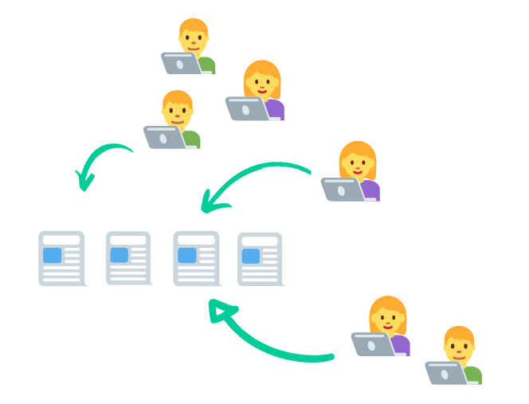
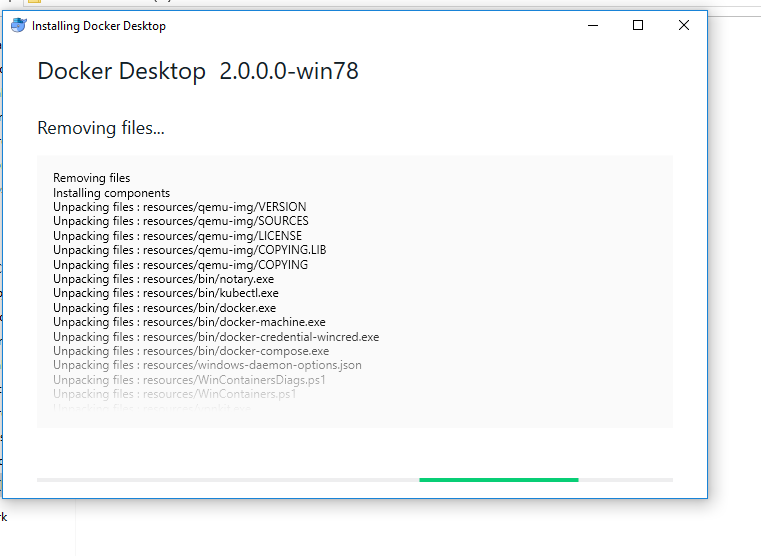
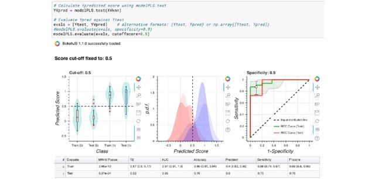
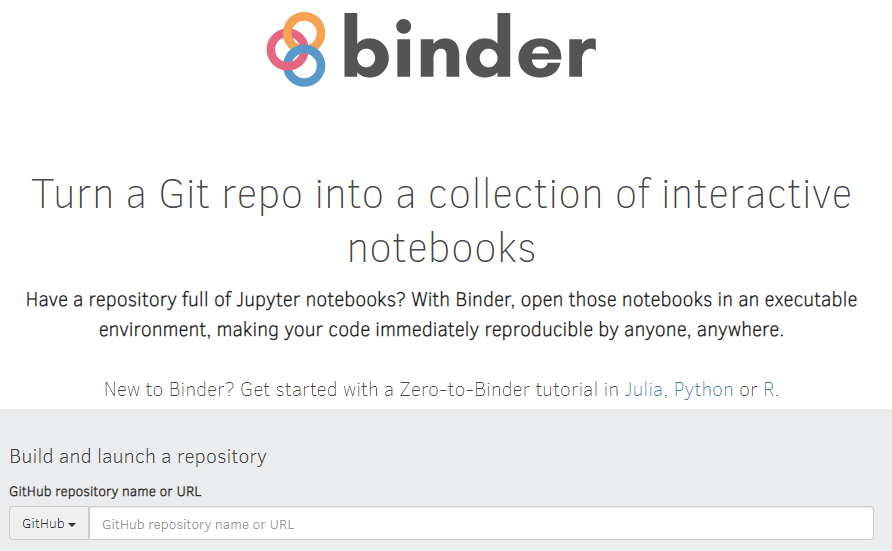

```{r setup, include=FALSE}
options(htmltools.dir.version = FALSE)
```

```{r xaringan-themer, include=FALSE, warning=FALSE}
library(xaringanthemer)
library(xaringanExtra)
library(tidyverse)
library(knitr)
library(icon)
library(kableExtra)
library(nomnoml)
xaringanExtra::use_logo(
  image_url = "https://raw.githubusercontent.com/rstudio/hex-stickers/master/PNG/xaringan.png"
)
xaringanExtra::use_panelset()
xaringanExtra::use_broadcast()
xaringanExtra::use_share_again()
#xaringanExtra::style_share_again(share_buttons = c("twitter", "linkedin"))
xaringanExtra::use_tachyons()
xaringanExtra::use_fit_screen()
xaringanExtra::use_tile_view() # O
style_mono_accent(
  base_color = "#0dc96f",
  background_color = "#ffffff",
  inverse_background_color = "#562457",
  header_color = "#562457",
  inverse_header_color = "#ffffff", 
  inverse_text_color = "#ffffff",
  code_inline_color = "#179c55",
  link_color= "#A406B2",
  text_font_size = "25px",
  header_font_google = google_font("Roboto", "Medium", "500"), #Popper
  text_font_google   = google_font("Lora", "Regular", "400"),
  code_font_google   = google_font("Fira Mono"),
  )
```

```{r metathis, echo=FALSE}
library(metathis)
meta() %>%
  meta_name("github-repo" = "flor14/rladies-jujuy") %>% 
  meta_social(
    title = "Toronto Data Workshop on Reproducibility",
    description = paste(
      "Choose your own adventure to a reproducible scientific article:", 
      "learnings from ReproHack"
    ),
    url = "https://https://flor14.github.io/toronto_data_workshop/what_i_learned_from_reprohack.html#1",
    image = "https://res.cloudinary.com/flor/image/upload/v1614305498/75581_l4kohr.jpg",
    image_alt = paste(
      "Florencia D'Andrea",
      "February 2021"
      ),
    og_type = "website",
    og_author = "Florencia D'Andrea",
    twitter_card_type = "summary_large_image",
    twitter_creator = "@cantoflor_87",
    twitter_site = "@cantoflor_87"
  )
```

background-image: url(imagenes/75581.jpg)
background-size: cover
class: bottom


.bg-washed-green.b--dark-green.ba.bw2.br3.shadow-5.ph4.mt5[
## Choose your own adventure to a reproducible scientific article
### **learnings from ReproHack**

Florencia D'Andrea

.large[Toronto Data Workshop on Reproducibility | Feb 2021 ]
]

---

background-image: url(imagenes/75581.jpg)
background-size: cover
class: center


.bg-washed-green.b--dark-green.ba.bw2.br3.shadow-5.ph4.mt5[

```{r toronto, echo = FALSE,  fig.show = "hold", out.width=150, fig.align = "default"}
knitr::include_graphics("imagenes/toronto.png")
knitr::include_graphics("imagenes/reprohack.png")
```


**Link to the slides**: [bit.ly/florencia_toronto](bit.ly/florencia_toronto)


]


---


```{r open_research, echo = FALSE, out.width=700, fig.align = "center"}
knitr::include_graphics("imagenes/openresearch.jpg")
```
.footnote[[The Turing Way Community, & Scriberia. (2020)](http://doi.org/10.5281/zenodo.3695300)]

---

class: middle, center

```{r circulo, echo = FALSE, out.width=250, fig.align = "center"}
knitr::include_graphics("imagenes/circulo.png")
```
## More articles with published code and data are accessible and **could be reproduced by everyone**


---

### The scientific community should learn about **reproducible practises** 


.pull-left[
* Track a complete history of your research and ensure the continuity of your work

* Facilitate collaboration 

* Publish validated research 

]

.pull-right[
```{r cultural_shift2, echo = FALSE, out.width=500, fig.align='center'}
knitr::include_graphics("imagenes/researchtools.jpg")
```
]

.footnote[[The Turing Way Community, & Scriberia. (2020)](http://doi.org/10.5281/zenodo.3695300)]

---

### The scientific community should learn about **reproducible practises** 


.pull-left[

* Write your papers efficiently

* Get credit for your work fairly
]

.pull-right[
```{r cultural_shift3, echo = FALSE, out.width=500, fig.align='center'}
knitr::include_graphics("imagenes/researchtools.jpg")
```
]


.footnote[[The Turing Way Community, & Scriberia. (2020)](http://doi.org/10.5281/zenodo.3695300)]
---

## Reproducibility is consider a proof of **Research Quality**

.pull-up[
```{r cd, echo=FALSE, out.width=400, fig.align='center'}

```
.footnote[[Codecheck Complete Article](https://www.nature.com/articles/d41586-020-02462-7)]
 ]
 
.pull-down[
```{r cd2, echo=FALSE, out.width=700, fig.align='center'}
knitr::include_graphics("imagenes/codecheck2.png")
```
]


---

class: middle, center

## ¿Are we living a cultural **change**?


<blockquote class="twitter-tweet" data-lang="ens"><p lang="en" dir="ltr">The advert asks for: 
"A commitment to following the best [..] practices in science, such as [..] sharing of computer code and writing reproducible research reports, [..]sharing of data whenever feasible"

Have you come across job descriptions asking for such a commitment before?</p>&mdash; ReproHack(@ReproHack) <a href="https://twitter.com/ReproHack/status/1296061566484385792?s=20">19 August 2020</a></blockquote>


.footnote[[ReproHack Twitter](https://twitter.com/ReproHack)]


---

class: middle, center

## ¿Are we living a cultural **change**?


```{r cultural_shift, echo = FALSE, out.width=700, fig.align='center'}
knitr::include_graphics("imagenes/CultureShift.jpg")
```

.footnote[[The Turing Way Community, & Scriberia. (2020)](http://doi.org/10.5281/zenodo.3695300)]

---

class: center, middle, inverse

## **ReproHack**
Learning from the experience


```{r rhack, echo = FALSE, out.width=150}
knitr::include_graphics("imagenes/reprohack.png")
```


---


## Hackathon

.pull-left[
### Authors 


Send their papers with **publicly available associated code and data**

```{r circulo2, echo = FALSE, out.width=300, fig.align = "center"}
knitr::include_graphics("imagenes/circulo.png")
```
]

.pull-right[
### Participants

Attempt to **reproduce published research** of their choice from a list of proposed papers

```{r sub_form, echo = FALSE, out.width=500, fig.align = "center"}

```
]

At the end, the participants give feedback to the authors 

---

## An example of a **submitted paper**  

Thanks [Luis Verde](https://twitter.com/LuisDVerde)

```{r sub_form3, echo = FALSE, out.width=700, fig.align = "center"}
knitr::include_graphics("imagenes/submited.png")
```


---

## As researchers, we know how a **manuscript** is organized

```{r paper, echo = FALSE, out.width=700}

```

---

class: inverse, center, middle

## How **code** and **data** could be organised?


---

## Research Compendium

.pull-left[

1. **Organize files** according to a prevailing convention.

2. Provide **separation between data, methods and results** expressing unambiguously the relationship between the three.

3. Specify the environment 
(+ **reproducibility**).


]

.pull-right[
```{r rc3, echo = FALSE, out.width=400}
knitr::include_graphics("imagenes/ResearchCompendium.jpg")
```
]

.footnote[[Marwick *et al.* (2018)](https://doi.org/10.1080/00031305.2017.1375986)]
---

## Research Compendium 

.pull-left[

```{r rc4, echo = FALSE, out.width=450, fig.align='center'}
knitr::include_graphics("imagenes/compendio1.png")
```
]

.pull-right[

.bg-washed-green.b--dark-green.ba.bw2.br3.shadow-5.ph4.mt5[
[`rrtools`](https://github.com/benmarwick/rrtools) provides instructions, templates and functions to make a basic compendium suitable for writing **reproducible research with R **.]

* Anna Krystalli's [`rrtools` Tutorial](https://annakrystalli.me/rrresearch/10_compendium.html) 

]

.footnote[[Marwick *et al.* (2018)](https://doi.org/10.1080/00031305.2017.1375986)]

---

## How data and code is shared?

```{r sub_form2, echo = FALSE, out.width=700,fig.align = "center"}
knitr::include_graphics("imagenes/submited2.png")
```

---
class: inverse, center, middle

# 1

## 📄

## `README`

Guide the reviewer to the results


---

## What a `README` should have?

* General information

* **Data and file** overview

--

* **Sharing and access** information

* **Methodological** information

--

### **Is all of this information necessary to reproduce the article?**

[Example `rrtools README`](https://github.com/annakrystalli/rrcompendiumDTB)


.footnote[[Guide to writing "readme" style metadata - Cornell University](https://data.research.cornell.edu/content/readme)]


---

class: inverse, middle, center

## 🧭

### What do we need?

Reading a license will not give us the steps we must take to reproduce the article.


---

## Explain HOW


```{r catego, echo = FALSE, out.width=500}

kableExtra::kbl(data.frame(Category = c("What", "Why", "How", "When", "Who", "References", "Contribution", "Other"),
           `Example section headings` = c("Introduction, project, background",
                                        "Advantages of the project, comparison with related work",
                                        "Getting started, how to run, installation, how to update, configuration, languages, dependencies,...",
                                        "Project status, versions, roadmap,...",
                                        "Project team, community, contact,...",
                                        "feedback, getting support, more information",
                                        "Contribution guidelines", " ") ),
           col.names = c("Category", "Example section headings")) %>% 
   kable_minimal() %>% 
   kable_styling() %>% 
  row_spec(3, bold = T, color = "white", background = "#D7261E") 


# knitr::include_graphics("imagenes/categorizing_readmes.png")
```

.footnote[[Prana *et al.* (2019)](https://link.springer.com/article/10.1007/s10664-018-9660-3#citeas)]


---


## What I find useful to reproduce the article results? 

A clear and detailed description in the `README` of the files/links necessary to run and where they are


```{r ej1, echo = FALSE, out.width=800}
knitr::include_graphics("imagenes/estructura.png")
```


---

class: inverse, middle, center


# 2

## 💻

#### How the computational environment is captured could change the experience of reproducing the article
### And what to write in the **README**


---


## Computational environment

## 💻

Characteristics of a computer that can affect the behavior of the work done on it, such as:

* your **operating system**

* what **software** do you have installed

* software **package versions** are installed

.footnote[[The Turing Way: A Handbook for Reproducible Data Science (2019)](https://the-turing-way.netlify.app/)]

---
## Computational Environments

Important to capture them to avoid:

* Problems when sharing your code

* That you code breaks with time and actualizations

```{r error, echo = FALSE, out.width=600}
knitr::include_graphics("imagenes/ErrorManagement.jpg")
```

.footnote[[The Turing Way Community, & Scriberia. (2020)](http://doi.org/10.5281/zenodo.3695300)]


---

### **3** examples of information to include in the `README` depending on how you are capturing the computational environment


**A.** Provide a plain text file with the **detailed description** of dependencies and software/hardware used

**B.** Describe how to **install** required software

**C.** Share a **link**

---

### **A.** Provide a plain text file with the **detailed description** of dependencies and software/hardware used

👩‍💻  ** Hackathon participant experience** `r icon::fontawesome("star", style = "solid")``r icon::fontawesome("star")``r icon::fontawesome("star")`

--

> *"Could be easier"*

```{r sessioninfo, echo = FALSE, out.width=600, fig.align='center'}

```


---

###  **B.** Describe how to **install** required software

example: Install Docker 

☕   **Hackathon participant experience** `r icon::fontawesome("star", style = "solid")``r icon::fontawesome("star", style = "solid")``r icon::fontawesome("star")`

--

> *"This will take some time. Let's go for a coffee"*

```{r docker, echo = FALSE, out.width=600, fig.align='center'}

```


---

### **C.** Share a **link**

example: Binder

😎 **Hackathon participant experience** `r icon::fontawesome("star", style = "solid")``r icon::fontawesome("star", style = "solid")``r icon::fontawesome("star", style = "solid")`

--

> *"So, I click a link and I get the results?"*

```{r binder, echo = FALSE, out.width=600}

```

.footnote[[Image from Mendez *et al.*(2019)](https://link.springer.com/article/10.1007/s11306-019-1588-0)]
---

```{r binder2, echo = FALSE, out.width=800}
knitr::include_graphics("imagenes/binder_comic.png")
```

---

```{r echo = FALSE, out.width=700,fig.align='center'}

```


Binder is an open source web service that lets users create **sharable, interactive, reproducible environments** in the cloud.

[Example](https://opendreamkit.org/2017/11/02/use-case-publishing-reproducible-notebooks/)

.footnote[[Binder 2.0 - Reproducible, interactive, sharable environments for science at scale](https://pdfs.semanticscholar.org/c043/bef741a9616d1144e0205ac21ceae881485d.pdf)]
---


## Capturing Computational Environments

```{r env, echo = FALSE, out.width=800, fig.align='center'}

# kableExtra::kbl(data.frame(uno = c("", "", "What is reproduced?"),
#            dos = c("",  "Software and versions", "Entire system"),
#            Graphical = c("", "Binder", "Virtual Machines"),
#            `Command line` = c("",  "Conda", "Containers"))) %>% 
#   kable_classic() %>%
#   add_header_above(c(" " = 2,  "Interaction style" = 2)) %>% 
#   collapse_rows(columns = 1, valign = "top")

knitr::include_graphics("imagenes/environments.png")
```


.footnote[[The Turing Way: A Handbook for Reproducible Data Science  (2019)](https://the-turing-way.netlify.app/reproducible-research/renv/renv-options.html)]


---
## The dark side of links 🌒


```{r notfound, echo = FALSE, out.width=600, fig.align='center'}
knitr::include_graphics("imagenes/links.png")
```

---

* **What happens when the technology fails?** 
* Should we provide more than one option?
* Should our code have **maintainers**?

```{r FixingLinks, echo = FALSE, fig.align='center', out.width=600}

```
.footnote[[The Turing Way Community, & Scriberia. (2020)](http://doi.org/10.5281/zenodo.3695300)]

---

# **{**Definition**}**
### Research software

.bg-washed-green.b--dark-green.ba.bw2.br3.shadow-5.ph4.mt5[
#### Software that is used to generate, process or analyse results that you intend to appear in a publication (either in a journal, conference paper, monograph, book or thesis).

#### Research software can be anything **from a few lines of code written by yourself, to a professionally developed software package**]

.footnote[[Hettrick *et al.* (2014)](https://doi.org/10.5281/zenodo.608046)]

---

class: middle, inverse, center

## 👩‍💻

### Did you ever consider that your next scientific article **can have not only readers but also users**?

---

class: middle, inverse, center


# 3

## 👩‍💻


## ~~REVIEWERS~~

## **USERS**


---

class: middle, inverse, center


# 4

## 📝

## Documentation

The more detailed the documentation, the easier it will be for someone who does not know about the technologies used in the article to reproduce it


#### Define **who** are your users and **write for them!**


---

class: center, middle

## ReproHack **feedback form**


Reproducibility ✅

Reusability ✅

Documentation ✅

Transparency ✅


---

class: inverse, middle, center

## What I have learned in **ReproHack**? ♻️


---

## What I have learned in **ReproHack**? ♻️

--

#### - It is important to write a **good README ** file

--

#### - How the **computational environment** is captured could change the experience of reproducing the article


--

#### - Write **detailed documentation** for your users

--

#### - **Researchers develop software** for their scientific articles (even if their are not aware of it)

---

class: inverse, center, middle


## 👉 You can have **your own experience!** 


---

class: inverse, middle, center

### Organize a remote hackathon 

Attend our events!


```{r repro, echo = FALSE, fig.align='center', out.width=500}

```

---
class: middle, center
# Join us!

```{r rh3, echo = FALSE, out.width=200, fig.align='center'}
knitr::include_graphics("imagenes/reprohack.png")
```

[Twitter](https://twitter.com/ReproHack)

[Slack](https://reprohack-autoinvite.herokuapp.com/)

[Email](reprohack.team@gmail.com)


---

# ReproHack in [LatinR 2020](https://latin-r.com/blog/reprohack)

[Playlist with 6 talks on reproducibility in Spanish](https://www.youtube.com/playlist?list=PL9-E3cL2KgKliN3DFBWfUAUNXco_NOAMQ)

```{r rhlr, echo=FALSE}
xaringanExtra::embed_xaringan(url = "https://flor14.github.io/latinr-reprohack/index.html#1")
```

---

## Ana Krystalli's talk in UseR! 2020

[Video](https://www.youtube.com/watch?v=KHMW8fV2NXo)

```{r rh, echo = FALSE, out.width=600, fig.align='center'}

```


---

class: middle, inverse, center


## 🤝 🏆 🤝

## Thanks to ReproHack **Team**!

Daniela Gawehns<br>
Anna Krystalli <br> 
Linda Nab <br> 
Ricarda Proppert <br> 
Paloma Rojas-Saunero <br> 
Florencia D'Andrea


---

class: inverse, center, middle

## References

---

background-image:  url(imagenes/75581.jpg)
background-size: cover

.bg-washed-green.b--dark-green.ba.bw2.br3.shadow-5.ph4.mt5[

**README**

* Cornell University - [Guide to writing "readme" style metadata](https://data.research.cornell.edu/content/readme) 

* Prana, G.A.A., Treude, C., Thung, F. et al. (2019) [Categorizing the Content of GitHub README Files.](https://link.springer.com/article/10.1007/s10664-018-9660-3#citeas) Empir Software Eng 24, 1296–1327 https://doi.org/10.1007/s10664-018-9660-3

]


---

background-image: url(imagenes/75581.jpg)
background-size: cover

.bg-washed-green.b--dark-green.ba.bw2.br3.shadow-5.ph4.mt5[

**Reproducible Research / Open Science**

* Hettrick, S., Antonioletti, M., Carr, L., Chue Hong, N., Crouch, S., De Roure, D., … Sufi, S. (2014). UK Research Software Survey 2014 [Data set]. Zenodo. http://doi.org/10.5281/zenodo.14809

* Marwick, B., Boettiger, C., & Mullen, L. (2018). [Packaging data analytical work reproducibly using R (and friends). The American Statistician 72(1), 80-88.](https://doi.org/10.1080/00031305.2017.1375986)

* Stodden, V. (2014). [Online; accessed 27. May 2020]. URL: https://www.edge.org/response-detail/25340.

* The Turing Way Community, Becky Arnold, Louise Bowler, Sarah Gibson, Patricia Herterich, Rosie Higman, … Kirstie Whitaker. (2019, March 25). [The Turing Way: A Handbook for Reproducible Data Science (Version v0.0.4). Zenodo. http://doi.org/10.5281/zenodo.3233986](https://the-turing-way.netlify.app/)

]

---

background-image: url(imagenes/75581.jpg)
background-size: cover

.bg-washed-green.b--dark-green.ba.bw2.br3.shadow-5.ph4.mt5[

#### Other Videos - Talks - Books - Blogs

* [Improve your workflow for reproducible science - Mine Çetinkaya-Rundel](https://mine-cetinkaya-rundel.github.io/improve-repro-workflow-reproducibilitea-2020/slides/improve-repro-workflow-reproducibilitea-2020.pdf)

* [How To Make Your Data Analysis Notebooks More Reproducible - Kartik Rham. RStudioConf::2019](https://rstudio.com/resources/rstudioconf-2019/a-guide-to-modern-reproducible-data-science-with-r-karthik-ram/) 

* [Reproducible Environments - RStudio](https://environments.rstudio.com/)

* [renv: Project Environments with R - RStudio blog](https://blog.rstudio.com/2019/11/06/renv-project-environments-for-r/)

* [ROpenSci - Reproducibility in Science A Guide to enhancing reproducibility in scientific results and writing](https://ropensci.github.io/reproducibility-guide/)

* [Putting the R into Reproducible Research - Anna Krystalli](https://annakrystalli.me/talks/r-in-repro-research.html#1)
]

---

background-image:  url(imagenes/75581.jpg)
background-size: cover


.bg-washed-green.b--dark-green.ba.bw2.br3.shadow-5.ph4.mt5[

#### Illustrations

* The Turing Way Community, & Scriberia. (2020, March 3). Illustrations from the Turing Way book dashes. Zenodo. http://doi.org/10.5281/zenodo.3695300

]


---
class: center, middle

## Thank you!

.pull-left[
#### Dr. Florencia D'Andrea 
**Postdoctoral Researcher**<br> 


`r icon::fontawesome("twitter")` [@cantoflor_87]("http://twitter.com/cantoflor_87")<br>
`r icon::fontawesome("link")` [florencia.netlify.app]("https://florencia.netlify.app/es-es/")
]

.pull-right[ 
```{r foto, echo = FALSE, out.width=250}
knitr::include_graphics("https://res.cloudinary.com/flor/image/upload/w_1000,c_fill,ar_1:1,g_auto,r_max/v1614343937/flor_pic_ceyztn.jpg")


```
]


---
background-image:  url(imagenes/75581.jpg)
background-size: cover
class: bottom

.bg-washed-green.b--dark-green.ba.bw2.br3.shadow-5.ph4.mt5[
<a rel="license" href="http://creativecommons.org/licenses/by/4.0/"></a><br />This work is licensed under a <a rel="license" href="http://creativecommons.org/licenses/by/4.0/">Creative Commons Attribution 4.0 International License</a>.


[Cover image from: rawpixel.com - www.freepik.es](www.freepik.es)
]

]
