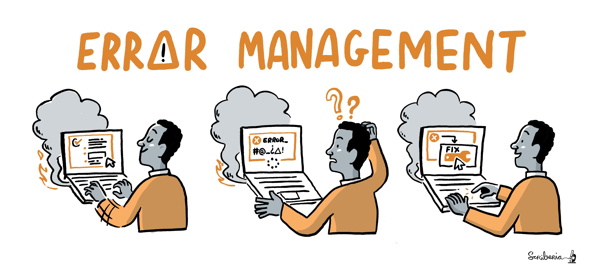
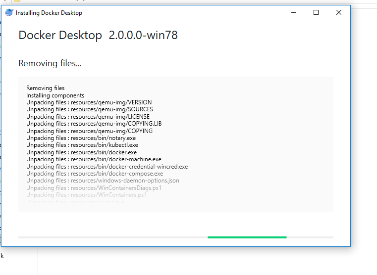
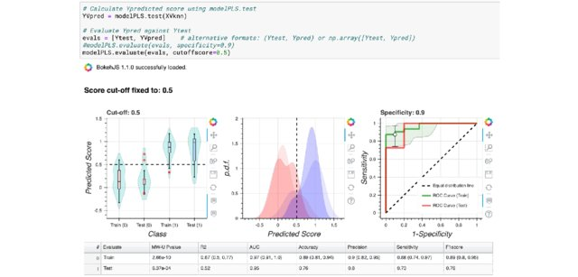

background-image: url(imagenes/75581.jpg)
background-size: cover
class: bottom


.bg-washed-green.b--dark-green.ba.bw2.br3.shadow-5.ph4.mt5[
## Choose your own adventure to a reproducible scientific article
### **learnings from ReproHack**

Florencia D'Andrea

.large[Toronto Data Workshop on Reproducibility | Feb 2021 ]
]

---

background-image: url(imagenes/75581.jpg)
background-size: cover
class: center


.bg-washed-green.b--dark-green.ba.bw2.br3.shadow-5.ph4.mt5[


**Link to the slides**: [bit.ly/reprohack_toronto](bit.ly/reprohack_toronto)


]


---


.footnote[[The Turing Way Community, & Scriberia. (2020)](http://doi.org/10.5281/zenodo.3695300)]

---

class: middle, center


## More articles with published code and data are accessible and **could be reproduced by everyone**


---

### The scientific community should learn about **reproducible practises** 


.pull-left[
* Track a complete history of your research and ensure the continuity of your work

* Facilitate collaboration 

* Publish validated research 

]

.pull-right[

]

.footnote[[The Turing Way Community, & Scriberia. (2020)](http://doi.org/10.5281/zenodo.3695300)]

---

### The scientific community should learn about **reproducible practises** 


.pull-left[

* Write your papers efficiently

* Get credit for your work fairly
]

.pull-right[

]


.footnote[[The Turing Way Community, & Scriberia. (2020)](http://doi.org/10.5281/zenodo.3695300)]
---

## Reproducibility is consider a proof of **Research Quality**

.pull-up[

.footnote[[Codecheck Complete Article](https://www.nature.com/articles/d41586-020-02462-7)]
 ]
 
.pull-down[

]


---

class: middle, center

## ¿Are we living a cultural **change**?


<blockquote class="twitter-tweet" data-lang="ens"><p lang="en" dir="ltr">The advert asks for: 
"A commitment to following the best [..] practices in science, such as [..] sharing of computer code and writing reproducible research reports, [..]sharing of data whenever feasible"

Have you come across job descriptions asking for such a commitment before?</p>&mdash; ReproHack(@ReproHack) <a href="https://twitter.com/ReproHack/status/1296061566484385792?s=20">19 August 2020</a></blockquote>


.footnote[[ReproHack Twitter](https://twitter.com/ReproHack)]


---

class: middle, center

## ¿Are we living a cultural **change**?


.footnote[[The Turing Way Community, & Scriberia. (2020)](http://doi.org/10.5281/zenodo.3695300)]

---

class: center, middle, inverse

## **ReproHack**
Learning from the experience


---


## Hackathon

.pull-left[
### Authors 


Send their papers with **publicly available associated code and data**


]

.pull-right[
### Participants

Attempt to **reproduce published research** of their choice from a list of proposed papers


]

At the end, the participants give feedback to the authors 

---

## An example of a **submitted paper**  

Thanks [Luis Verde](https://twitter.com/LuisDVerde)


---

## As researchers, we know how a **manuscript** is organized


---

class: inverse, center, middle

## How **code** and **data** could be organised?


---

## Research Compendium

.pull-left[

1. **Organize files** according to a prevailing convention.

2. Provide **separation between data, methods and results** expressing unambiguously the relationship between the three.

3. Specify the environment 
(+ **reproducibility**).


]

.pull-right[

]

.footnote[[Marwick *et al.* (2018)](https://doi.org/10.1080/00031305.2017.1375986)]
---

## Research Compendium 

.pull-left[


]

.pull-right[

.bg-washed-green.b--dark-green.ba.bw2.br3.shadow-5.ph4.mt5[
[`rrtools`](https://github.com/benmarwick/rrtools) provides instructions, templates and functions to make a basic compendium suitable for writing **reproducible research with R **.]

* Anna Krystalli's [`rrtools` Tutorial](https://annakrystalli.me/rrresearch/10_compendium.html) 

]

.footnote[[Marwick *et al.* (2018)](https://doi.org/10.1080/00031305.2017.1375986)]

---

## How data and code is shared?


---
class: inverse, center, middle

# 1

## 📄

## `README`

Guide the reviewer to the results


---

## What a `README` should have?

* General information

* **Data and file** overview

--

* **Sharing and access** information

* **Methodological** information

--

### **Is all of this information necessary to reproduce the article?**

[Example `rrtools README`](https://github.com/annakrystalli/rrcompendiumDTB)


.footnote[[Guide to writing "readme" style metadata - Cornell University](https://data.research.cornell.edu/content/readme)]


---

class: inverse, middle, center

## 🧭

### What do we need?

Reading a license will not give us the steps we must take to reproduce the article.


---

## Explain HOW


<table class=" lightable-minimal table" style='font-family: "Trebuchet MS", verdana, sans-serif; margin-left: auto; margin-right: auto; margin-left: auto; margin-right: auto;'>
 <thead>
  <tr>
   <th style="text-align:left;"> Category </th>
   <th style="text-align:left;"> Example section headings </th>
  </tr>
 </thead>
<tbody>
  <tr>
   <td style="text-align:left;"> What </td>
   <td style="text-align:left;"> Introduction, project, background </td>
  </tr>
  <tr>
   <td style="text-align:left;"> Why </td>
   <td style="text-align:left;"> Advantages of the project, comparison with related work </td>
  </tr>
  <tr>
   <td style="text-align:left;font-weight: bold;color: white !important;background-color: #D7261E !important;"> How </td>
   <td style="text-align:left;font-weight: bold;color: white !important;background-color: #D7261E !important;"> Getting started, how to run, installation, how to update, configuration, languages, dependencies,... </td>
  </tr>
  <tr>
   <td style="text-align:left;"> When </td>
   <td style="text-align:left;"> Project status, versions, roadmap,... </td>
  </tr>
  <tr>
   <td style="text-align:left;"> Who </td>
   <td style="text-align:left;"> Project team, community, contact,... </td>
  </tr>
  <tr>
   <td style="text-align:left;"> References </td>
   <td style="text-align:left;"> feedback, getting support, more information </td>
  </tr>
  <tr>
   <td style="text-align:left;"> Contribution </td>
   <td style="text-align:left;"> Contribution guidelines </td>
  </tr>
  <tr>
   <td style="text-align:left;"> Other </td>
   <td style="text-align:left;">  </td>
  </tr>
</tbody>
</table>

.footnote[[Prana *et al.* (2019)](https://link.springer.com/article/10.1007/s10664-018-9660-3#citeas)]


---


## What I find useful to reproduce the article results? 

A clear and detailed description in the `README` of the files/links necessary to run and where they are


---

class: inverse, middle, center


# 2

## 💻

#### How the computational environment is captured could change the experience of reproducing the article
### And what to write in the **README**


---


## Computational environment

## 💻

Characteristics of a computer that can affect the behavior of the work done on it, such as:

* your **operating system**

* what **software** do you have installed

* software **package versions** are installed

.footnote[[The Turing Way: A Handbook for Reproducible Data Science (2019)](https://the-turing-way.netlify.app/)]

---
## Computational Environments

Important to capture them to avoid:

* Problems when sharing your code

* That you code breaks with time and actualizations



.footnote[[The Turing Way Community, & Scriberia. (2020)](http://doi.org/10.5281/zenodo.3695300)]


---

### **3** examples of information to include in the `README` depending on how you are capturing the computational environment


**A.** Provide a plain text file with the **detailed description** of dependencies and software/hardware used

**B.** Describe how to **install** required software

**C.** Share a **link**

---

### **A.** Provide a plain text file with the **detailed description** of dependencies and software/hardware used

👩‍💻  ** Hackathon participant experience** <svg viewBox="0 0 576 512" xmlns="http://www.w3.org/2000/svg" style="height:1em;fill:currentColor;position:relative;display:inline-block;top:.1em;">  [ comment ]  <path d="M259.3 17.8L194 150.2 47.9 171.5c-26.2 3.8-36.7 36.1-17.7 54.6l105.7 103-25 145.5c-4.5 26.3 23.2 46 46.4 33.7L288 439.6l130.7 68.7c23.2 12.2 50.9-7.4 46.4-33.7l-25-145.5 105.7-103c19-18.5 8.5-50.8-17.7-54.6L382 150.2 316.7 17.8c-11.7-23.6-45.6-23.9-57.4 0z"></path></svg><svg viewBox="0 0 576 512" xmlns="http://www.w3.org/2000/svg" style="height:1em;fill:currentColor;position:relative;display:inline-block;top:.1em;">  [ comment ]  <path d="M528.1 171.5L382 150.2 316.7 17.8c-11.7-23.6-45.6-23.9-57.4 0L194 150.2 47.9 171.5c-26.2 3.8-36.7 36.1-17.7 54.6l105.7 103-25 145.5c-4.5 26.3 23.2 46 46.4 33.7L288 439.6l130.7 68.7c23.2 12.2 50.9-7.4 46.4-33.7l-25-145.5 105.7-103c19-18.5 8.5-50.8-17.7-54.6zM388.6 312.3l23.7 138.4L288 385.4l-124.3 65.3 23.7-138.4-100.6-98 139-20.2 62.2-126 62.2 126 139 20.2-100.6 98z"></path></svg><svg viewBox="0 0 576 512" xmlns="http://www.w3.org/2000/svg" style="height:1em;fill:currentColor;position:relative;display:inline-block;top:.1em;">  [ comment ]  <path d="M528.1 171.5L382 150.2 316.7 17.8c-11.7-23.6-45.6-23.9-57.4 0L194 150.2 47.9 171.5c-26.2 3.8-36.7 36.1-17.7 54.6l105.7 103-25 145.5c-4.5 26.3 23.2 46 46.4 33.7L288 439.6l130.7 68.7c23.2 12.2 50.9-7.4 46.4-33.7l-25-145.5 105.7-103c19-18.5 8.5-50.8-17.7-54.6zM388.6 312.3l23.7 138.4L288 385.4l-124.3 65.3 23.7-138.4-100.6-98 139-20.2 62.2-126 62.2 126 139 20.2-100.6 98z"></path></svg>

--

> *"Could be easier"*


---

###  **B.** Describe how to **install** required software

example: Install Docker 

☕   **Hackathon participant experience** <svg viewBox="0 0 576 512" xmlns="http://www.w3.org/2000/svg" style="height:1em;fill:currentColor;position:relative;display:inline-block;top:.1em;">  [ comment ]  <path d="M259.3 17.8L194 150.2 47.9 171.5c-26.2 3.8-36.7 36.1-17.7 54.6l105.7 103-25 145.5c-4.5 26.3 23.2 46 46.4 33.7L288 439.6l130.7 68.7c23.2 12.2 50.9-7.4 46.4-33.7l-25-145.5 105.7-103c19-18.5 8.5-50.8-17.7-54.6L382 150.2 316.7 17.8c-11.7-23.6-45.6-23.9-57.4 0z"></path></svg><svg viewBox="0 0 576 512" xmlns="http://www.w3.org/2000/svg" style="height:1em;fill:currentColor;position:relative;display:inline-block;top:.1em;">  [ comment ]  <path d="M259.3 17.8L194 150.2 47.9 171.5c-26.2 3.8-36.7 36.1-17.7 54.6l105.7 103-25 145.5c-4.5 26.3 23.2 46 46.4 33.7L288 439.6l130.7 68.7c23.2 12.2 50.9-7.4 46.4-33.7l-25-145.5 105.7-103c19-18.5 8.5-50.8-17.7-54.6L382 150.2 316.7 17.8c-11.7-23.6-45.6-23.9-57.4 0z"></path></svg><svg viewBox="0 0 576 512" xmlns="http://www.w3.org/2000/svg" style="height:1em;fill:currentColor;position:relative;display:inline-block;top:.1em;">  [ comment ]  <path d="M528.1 171.5L382 150.2 316.7 17.8c-11.7-23.6-45.6-23.9-57.4 0L194 150.2 47.9 171.5c-26.2 3.8-36.7 36.1-17.7 54.6l105.7 103-25 145.5c-4.5 26.3 23.2 46 46.4 33.7L288 439.6l130.7 68.7c23.2 12.2 50.9-7.4 46.4-33.7l-25-145.5 105.7-103c19-18.5 8.5-50.8-17.7-54.6zM388.6 312.3l23.7 138.4L288 385.4l-124.3 65.3 23.7-138.4-100.6-98 139-20.2 62.2-126 62.2 126 139 20.2-100.6 98z"></path></svg>

--

> *"This will take some time. Let's go for a coffee"*




---

### **C.** Share a **link**

example: Binder

😎 **Hackathon participant experience** <svg viewBox="0 0 576 512" xmlns="http://www.w3.org/2000/svg" style="height:1em;fill:currentColor;position:relative;display:inline-block;top:.1em;">  [ comment ]  <path d="M259.3 17.8L194 150.2 47.9 171.5c-26.2 3.8-36.7 36.1-17.7 54.6l105.7 103-25 145.5c-4.5 26.3 23.2 46 46.4 33.7L288 439.6l130.7 68.7c23.2 12.2 50.9-7.4 46.4-33.7l-25-145.5 105.7-103c19-18.5 8.5-50.8-17.7-54.6L382 150.2 316.7 17.8c-11.7-23.6-45.6-23.9-57.4 0z"></path></svg><svg viewBox="0 0 576 512" xmlns="http://www.w3.org/2000/svg" style="height:1em;fill:currentColor;position:relative;display:inline-block;top:.1em;">  [ comment ]  <path d="M259.3 17.8L194 150.2 47.9 171.5c-26.2 3.8-36.7 36.1-17.7 54.6l105.7 103-25 145.5c-4.5 26.3 23.2 46 46.4 33.7L288 439.6l130.7 68.7c23.2 12.2 50.9-7.4 46.4-33.7l-25-145.5 105.7-103c19-18.5 8.5-50.8-17.7-54.6L382 150.2 316.7 17.8c-11.7-23.6-45.6-23.9-57.4 0z"></path></svg><svg viewBox="0 0 576 512" xmlns="http://www.w3.org/2000/svg" style="height:1em;fill:currentColor;position:relative;display:inline-block;top:.1em;">  [ comment ]  <path d="M259.3 17.8L194 150.2 47.9 171.5c-26.2 3.8-36.7 36.1-17.7 54.6l105.7 103-25 145.5c-4.5 26.3 23.2 46 46.4 33.7L288 439.6l130.7 68.7c23.2 12.2 50.9-7.4 46.4-33.7l-25-145.5 105.7-103c19-18.5 8.5-50.8-17.7-54.6L382 150.2 316.7 17.8c-11.7-23.6-45.6-23.9-57.4 0z"></path></svg>

--

> *"So, I click a link and I get the results?"*



.footnote[[Image from Mendez *et al.*(2019)](https://link.springer.com/article/10.1007/s11306-019-1588-0)]
---


---


Binder is an open source web service that lets users create **sharable, interactive, reproducible environments** in the cloud.

[Example](https://opendreamkit.org/2017/11/02/use-case-publishing-reproducible-notebooks/)

.footnote[[Binder 2.0 - Reproducible, interactive, sharable environments for science at scale](https://pdfs.semanticscholar.org/c043/bef741a9616d1144e0205ac21ceae881485d.pdf)]
---


## Capturing Computational Environments


.footnote[[The Turing Way: A Handbook for Reproducible Data Science  (2019)](https://the-turing-way.netlify.app/reproducible-research/renv/renv-options.html)]


---
## The dark side of links 🌒


---

* **What happens when the technology fails?** 
* Should we provide more than one option?
* Should our code have **maintainers**?


.footnote[[The Turing Way Community, & Scriberia. (2020)](http://doi.org/10.5281/zenodo.3695300)]

---

# **{**Definition**}**
### Research software

.bg-washed-green.b--dark-green.ba.bw2.br3.shadow-5.ph4.mt5[
#### Software that is used to generate, process or analyse results that you intend to appear in a publication (either in a journal, conference paper, monograph, book or thesis).

#### Research software can be anything **from a few lines of code written by yourself, to a professionally developed software package**]

.footnote[[Hettrick *et al.* (2014)](https://doi.org/10.5281/zenodo.608046)]

---

class: middle, inverse, center

## 👩‍💻

### Did you ever consider that your next scientific article **can have not only readers but also users**?

---

class: middle, inverse, center


# 3

## 👩‍💻


## ~~REVIEWERS~~

## **USERS**


---

class: middle, inverse, center


# 4

## 📝

## Documentation

The more detailed the documentation, the easier it will be for someone who does not know about the technologies used in the article to reproduce it


#### Define **who** are your users and **write for them!**


---

class: center, middle

## ReproHack **feedback form**


Reproducibility ✅

Reusability ✅

Documentation ✅

Transparency ✅


---

class: inverse, middle, center

## What I have learned in **ReproHack**? ♻️


---

## What I have learned in **ReproHack**? ♻️

--

#### - It is important to write a **good README ** file

--

#### - How the **computational environment** is captured could change the experience of reproducing the article


--

#### - Write **detailed documentation** for your users

--

#### - **Researchers develop software** for their scientific articles (even if their are not aware of it)

---

class: inverse, center, middle


## 👉 You can have **your own experience!** 


---

class: inverse, middle, center

### Organize a remote hackathon 

Attend our events!


---
class: middle, center
# Join us!


[Twitter](https://twitter.com/ReproHack)

[Slack](https://reprohack-autoinvite.herokuapp.com/)

[Email](reprohack.team@gmail.com)


---

# ReproHack in [LatinR 2020](https://latin-r.com/blog/reprohack)

[Playlist with 6 talks on reproducibility in Spanish](https://www.youtube.com/playlist?list=PL9-E3cL2KgKliN3DFBWfUAUNXco_NOAMQ)


```{=html}
<div class="shareagain" style="min-width:300px;margin:1em auto;">
<iframe src="https://flor14.github.io/latinr-reprohack/index.html#1" width="1600" height="900" style="border:2px solid currentColor;" loading="lazy" allowfullscreen></iframe>
<script>fitvids('.shareagain', {players: 'iframe'});</script>
</div>
```

---

## Ana Krystalli's talk in UseR! 2020

[Video](https://www.youtube.com/watch?v=KHMW8fV2NXo)


---

class: middle, inverse, center


## 🤝 🏆 🤝

## Thanks to ReproHack **Team**!

Daniela Gawehns<br>
Anna Krystalli <br> 
Linda Nab <br> 
Ricarda Proppert <br> 
Paloma Rojas-Saunero <br> 
Florencia D'Andrea


---

class: inverse, center, middle

## References

---

background-image:  url(imagenes/75581.jpg)
background-size: cover

.bg-washed-green.b--dark-green.ba.bw2.br3.shadow-5.ph4.mt5[

**README**

* Cornell University - [Guide to writing "readme" style metadata](https://data.research.cornell.edu/content/readme) 

* Prana, G.A.A., Treude, C., Thung, F. et al. (2019) [Categorizing the Content of GitHub README Files.](https://link.springer.com/article/10.1007/s10664-018-9660-3#citeas) Empir Software Eng 24, 1296–1327 https://doi.org/10.1007/s10664-018-9660-3

]


---

background-image: url(imagenes/75581.jpg)
background-size: cover

.bg-washed-green.b--dark-green.ba.bw2.br3.shadow-5.ph4.mt5[

**Reproducible Research / Open Science**

* Hettrick, S., Antonioletti, M., Carr, L., Chue Hong, N., Crouch, S., De Roure, D., … Sufi, S. (2014). UK Research Software Survey 2014 [Data set]. Zenodo. http://doi.org/10.5281/zenodo.14809

* Marwick, B., Boettiger, C., & Mullen, L. (2018). [Packaging data analytical work reproducibly using R (and friends). The American Statistician 72(1), 80-88.](https://doi.org/10.1080/00031305.2017.1375986)

* Stodden, V. (2014). [Online; accessed 27. May 2020]. URL: https://www.edge.org/response-detail/25340.

* The Turing Way Community, Becky Arnold, Louise Bowler, Sarah Gibson, Patricia Herterich, Rosie Higman, … Kirstie Whitaker. (2019, March 25). [The Turing Way: A Handbook for Reproducible Data Science (Version v0.0.4). Zenodo. http://doi.org/10.5281/zenodo.3233986](https://the-turing-way.netlify.app/)

]

---

background-image: url(imagenes/75581.jpg)
background-size: cover

.bg-washed-green.b--dark-green.ba.bw2.br3.shadow-5.ph4.mt5[

#### Other Videos - Talks - Books - Blogs

* [Improve your workflow for reproducible science - Mine Çetinkaya-Rundel](https://mine-cetinkaya-rundel.github.io/improve-repro-workflow-reproducibilitea-2020/slides/improve-repro-workflow-reproducibilitea-2020.pdf)

* [How To Make Your Data Analysis Notebooks More Reproducible - Kartik Rham. RStudioConf::2019](https://rstudio.com/resources/rstudioconf-2019/a-guide-to-modern-reproducible-data-science-with-r-karthik-ram/) 

* [Reproducible Environments - RStudio](https://environments.rstudio.com/)

* [renv: Project Environments with R - RStudio blog](https://blog.rstudio.com/2019/11/06/renv-project-environments-for-r/)

* [ROpenSci - Reproducibility in Science A Guide to enhancing reproducibility in scientific results and writing](https://ropensci.github.io/reproducibility-guide/)

* [Putting the R into Reproducible Research - Anna Krystalli](https://annakrystalli.me/talks/r-in-repro-research.html#1)
]

---

background-image:  url(imagenes/75581.jpg)
background-size: cover


.bg-washed-green.b--dark-green.ba.bw2.br3.shadow-5.ph4.mt5[

#### Illustrations

* The Turing Way Community, & Scriberia. (2020, March 3). Illustrations from the Turing Way book dashes. Zenodo. http://doi.org/10.5281/zenodo.3695300

]


---
class: center, middle

## Thank you!

.pull-left[
#### Dr. Florencia D'Andrea 
**Postdoctoral Researcher**<br> 


<svg viewBox="0 0 512 512" xmlns="http://www.w3.org/2000/svg" style="height:1em;fill:currentColor;position:relative;display:inline-block;top:.1em;">  [ comment ]  <path d="M459.37 151.716c.325 4.548.325 9.097.325 13.645 0 138.72-105.583 298.558-298.558 298.558-59.452 0-114.68-17.219-161.137-47.106 8.447.974 16.568 1.299 25.34 1.299 49.055 0 94.213-16.568 130.274-44.832-46.132-.975-84.792-31.188-98.112-72.772 6.498.974 12.995 1.624 19.818 1.624 9.421 0 18.843-1.3 27.614-3.573-48.081-9.747-84.143-51.98-84.143-102.985v-1.299c13.969 7.797 30.214 12.67 47.431 13.319-28.264-18.843-46.781-51.005-46.781-87.391 0-19.492 5.197-37.36 14.294-52.954 51.655 63.675 129.3 105.258 216.365 109.807-1.624-7.797-2.599-15.918-2.599-24.04 0-57.828 46.782-104.934 104.934-104.934 30.213 0 57.502 12.67 76.67 33.137 23.715-4.548 46.456-13.32 66.599-25.34-7.798 24.366-24.366 44.833-46.132 57.827 21.117-2.273 41.584-8.122 60.426-16.243-14.292 20.791-32.161 39.308-52.628 54.253z"></path></svg> [@cantoflor_87]("http://twitter.com/cantoflor_87")<br>
<svg viewBox="0 0 512 512" xmlns="http://www.w3.org/2000/svg" style="height:1em;fill:currentColor;position:relative;display:inline-block;top:.1em;">  [ comment ]  <path d="M326.612 185.391c59.747 59.809 58.927 155.698.36 214.59-.11.12-.24.25-.36.37l-67.2 67.2c-59.27 59.27-155.699 59.262-214.96 0-59.27-59.26-59.27-155.7 0-214.96l37.106-37.106c9.84-9.84 26.786-3.3 27.294 10.606.648 17.722 3.826 35.527 9.69 52.721 1.986 5.822.567 12.262-3.783 16.612l-13.087 13.087c-28.026 28.026-28.905 73.66-1.155 101.96 28.024 28.579 74.086 28.749 102.325.51l67.2-67.19c28.191-28.191 28.073-73.757 0-101.83-3.701-3.694-7.429-6.564-10.341-8.569a16.037 16.037 0 0 1-6.947-12.606c-.396-10.567 3.348-21.456 11.698-29.806l21.054-21.055c5.521-5.521 14.182-6.199 20.584-1.731a152.482 152.482 0 0 1 20.522 17.197zM467.547 44.449c-59.261-59.262-155.69-59.27-214.96 0l-67.2 67.2c-.12.12-.25.25-.36.37-58.566 58.892-59.387 154.781.36 214.59a152.454 152.454 0 0 0 20.521 17.196c6.402 4.468 15.064 3.789 20.584-1.731l21.054-21.055c8.35-8.35 12.094-19.239 11.698-29.806a16.037 16.037 0 0 0-6.947-12.606c-2.912-2.005-6.64-4.875-10.341-8.569-28.073-28.073-28.191-73.639 0-101.83l67.2-67.19c28.239-28.239 74.3-28.069 102.325.51 27.75 28.3 26.872 73.934-1.155 101.96l-13.087 13.087c-4.35 4.35-5.769 10.79-3.783 16.612 5.864 17.194 9.042 34.999 9.69 52.721.509 13.906 17.454 20.446 27.294 10.606l37.106-37.106c59.271-59.259 59.271-155.699.001-214.959z"></path></svg> [florencia.netlify.app]("https://florencia.netlify.app/es-es/")
]

.pull-right[ 

]


---
background-image:  url(imagenes/75581.jpg)
background-size: cover
class: bottom

.bg-washed-green.b--dark-green.ba.bw2.br3.shadow-5.ph4.mt5[

**Link to the slides**: [bit.ly/reprohack_toronto](bit.ly/reprohack_toronto)


<a rel="license" href="http://creativecommons.org/licenses/by/4.0/"></a><br />This work is licensed under a <a rel="license" href="http://creativecommons.org/licenses/by/4.0/">Creative Commons Attribution 4.0 International License</a>.

[Cover image from: rawpixel.com - www.freepik.es](www.freepik.es)
]

]
