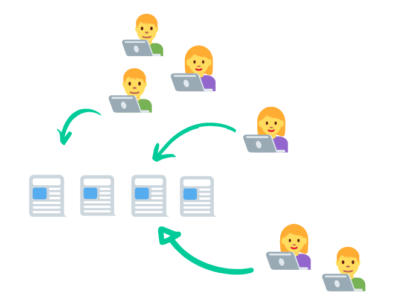
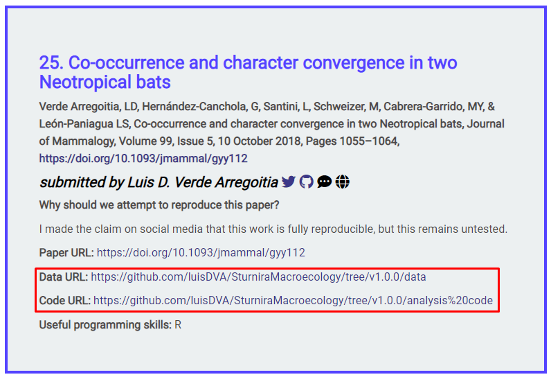
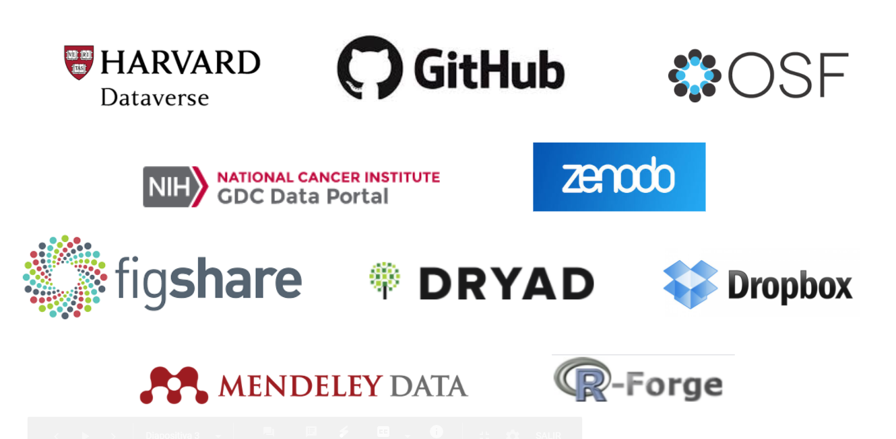
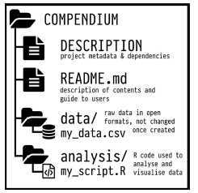
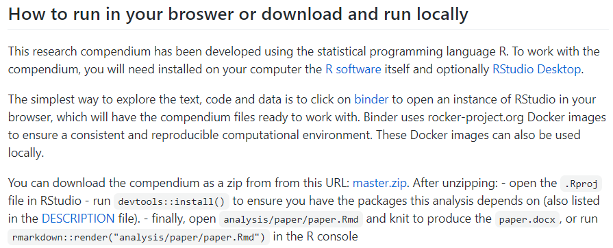
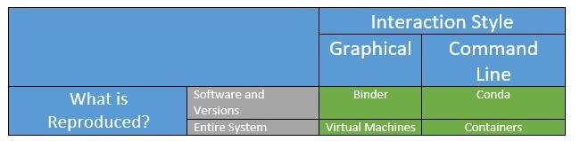
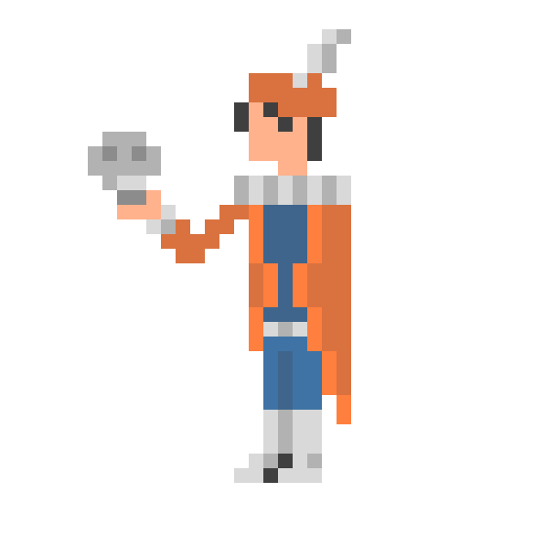

background-image: url(imagenes/75581.jpg)
background-size: cover
class: bottom


.bg-washed-green.b--dark-green.ba.bw2.br3.shadow-5.ph4.mt5[
### Choose your own adventure to a reproducible scientific article
### **learnings from ReproHack**

 Florencia D'Andrea
 .large[Toronto Data Workshop on Reproducibility | Feb 2021
]
]

---

<a href='https://www.freepik.es/vectores/fondo'>Vector de Fondo creado por rawpixel.com - www.freepik.es</a>

Link to the slides: bit.ly/

The full citations are at the end


.footnote[[Here there are links]()]


---

#### Open Science

.bg-washed-green.b--dark-green.ba.bw2.br3.shadow-5.ph4.mt5[

to make the primary outputs of publicly funded research results – publications and the research data – publicly accessible in digital format with no or minimal restriction as a means for accelerating research; these efforts are in the interest of enhancing transparency and collaboration, and fostering innovation.

]


.footnote[[The Turing Way Community (2019)](https://the-turing-way.netlify.app/reproducible-research/open/open-resources.html) / 
[OECD (2015)](https://www.fct.pt/dsi/docs/Making_Open_Science_a_Reality.pdf)]

---

Researchers are sharing their code and data


.footnote[[The Turing Way Community, & Scriberia. (2020)]( http://doi.org/10.5281/zenodo.3695300)]]

---


## Articles can now be reproduced


---

## CodeCheck 

.pull-up[

.footnote[[Codecheck](https://www.nature.com/articles/d41586-020-02462-7)]
 ]
 
.pull-down[

]


---
class: middle, center

## ¿A cultural change?

.pull-left[
<blockquote class="twitter-tweet" data-lang="ens"><p lang="en" dir="ltr">The advert asks for: 
"A commitment to following the best [..] practices in science, such as [..] sharing of computer code and writing reproducible research reports, [..]sharing of data whenever feasible"

Have you come across job descriptions asking for such a commitment before?</p>&mdash; ReproHack(@ReproHack) <a href="https://twitter.com/ReproHack/status/1296061566484385792?s=20">19 August 2020</a></blockquote>
]

.pull-right[

The advert asks for: 
"A commitment to following the best [..] practices in science, such as [..] sharing of computer code and writing reproducible research reports, [..]sharing of data whenever feasible"

**Have you come across job descriptions asking for such a commitment before?**

]

.footnote[[Twitter ReproHack](https://twitter.com/ReproHack)]

---

### Reproducibility is something researchers should know

Make it easy to share their work 

It will last more time


---

class: center, middle, inverse
## **ReproHack**
Learning from the experience


---

## As researchers, we know how a manuscript is organized


---

class: inverse, center, middle

## How **code** and **data** could be organised?

---

## Research Compendium

.pull-left[

* **Organize files** according to a prevailing convention.

* Provide **separation between data, methods and results** expressing unambiguously the relationship between the three.

* Specify the environment (+ **reproducibility**).


]

.pull-right[

]

.footnote[[Marwick *et al.* (2018)](https://doi.org/10.1080/00031305.2017.1375986)]

---


## Hackathon

#### Authors 


Send their papers with **publicly available associated code and data**


---

## Hackathon

#### Participants

Attempt to **reproduce published research** of their choice from a list of proposed 




---

## Authors 

article + code + data 


---

## How data and code is shared?




---

### This link led us to...



You should give clear instructions to the reviewers on how to access the material to reproduce 

.footnote[[Check the differences here]()]

---

class: inverse, center, middle

## **Readme**

Guide the reviewer to your results


---

## What a **readme** should have?

* General information

* Data and file overview

--

* Sharing and access information

* Methodological information

--

**All of this information is necessary to reproduce the article?**

--

.footnote[[Guide to writing "readme" style metadata - RESEARCH DATA MANAGEMENT SERVICE GROUP - Cornell University](https://data.research.cornell.edu/content/readme)]


---


🧭

For example,
including licenses is important to indicate to another person if the data and code could be reused and how. But reading a license will not give us the steps we must take to reproduce the article.

--
## What we need?

---

## HOW?


.footnote[[Prana *et al.* (2019)](https://link.springer.com/article/10.1007/s10664-018-9660-3#citeas)]

---
## Research Compendium

.pull-left[

* **Organize files** according to a prevailing convention.

* Provide **separation between data, methods and results** expressing unambiguously the relationship between the three.

* Specify the environment (+ **reproducibility**).


]

.pull-right[

]

.footnote[[Marwick *et al.* (2018)](https://doi.org/10.1080/00031305.2017.1375986)]

---

#####  **Organize files** according to a prevailing convention.

.pull-left[

]

.pull-right[

]

.footnote[[Marwick *et al.* (2018)](https://doi.org/10.1080/00031305.2017.1375986)]
---

## What I find useful to reproduce the article results? 

A clear and detailed description of the files/links necessary and where they are


---

##  `rrtools` Package
#### Research compendiums in R


.bg-washed-green.b--dark-green.ba.bw2.br3.shadow-5.ph4.mt5[
[`rrtools`](https://github.com/benmarwick/rrtools) proporciona instrucciones, plantillas y funciones para hacer un compendio básico adecuado para escribir **investigaciones reproducibles con R**.]

.footnote[[Marwick *et al.* (2018)](https://doi.org/10.1080/00031305.2017.1375986)]


---

class: inverse, middle, center

### The way you capture the computational environment will change the experience of reproducing the article
Environment specified (in README)

.footnote[[HOW (AND WHY) TO MAKE A RESEARCH COMPENDIUM - Dr. Max Joseph ](https://mbjoseph.github.io/intro-research-compendia/#1)]

---

## As author I want to ensure the reproducibility of my work

.bg-washed-green.b--dark-green.ba.bw2.br3.shadow-5.ph4.mt5[
**Computational reproducibility**

When detailed information is provided about code, software, hardware and implementation details. ]

.footnote[[Stodden](https://the-turing-way.netlify.app/reproducible-research/overview/overview-definitions.html#:~:text=At%20The%20Turing%20Way%2C%20we,that%20the%20original%20team%20used.&text=Reproducible%3A%20A%20result%20is%20reproducible,consistently%20produces%20the%20same%20answer.)]
---

## Computational environment

Characteristics of a computer that can affect the behavior of the work done on it, such as:

* your **operating system**

* what **software** do you have installed

* the software **package versions** installed

.footnote[[The Turing Way Community (2019)](https://the-turing-way.netlify.app/)]

---

## Computational environment

> "At its most basic, this could be a plain text file that includes a short list of the names and version numbers of the software and other critical tools used for the analysis." 


.footnote[Marwick *et al.* (2018)](https://doi.org/10.1080/00031305.2017.1375986)]

---

#### A **detailed description** of dependencies and software/hardware used


---

## How to **Install** software

example: information to run a Docker container




---

## Sharing a **link** to an interactive notebook

example: Binder


---

class: inverse, center, middle, 

## ☁💻☁
### Binder’s goal is to lower the barrier to interactivity, and to allow users to utilize code that is hosted in repository providers such as GitHub

.footnote[[Binder 2.0 - Reproducible, interactive, sharable environments for science at scale](https://pdfs.semanticscholar.org/c043/bef741a9616d1144e0205ac21ceae881485d.pdf)]


---

# Binder

Binder is an open source web service that lets users create sharable, interactive, reproducible environments in the cloud.


---
## Environments




.footnote[[TTW](https://the-turing-way.netlify.app/reproducible-research/renv/renv-options.html)]


---

class: middle, inverse, center
## Did you ever consider that your next scientific article can have not only readers but also **users**?

---

## Documentation

The more detailed the documentation, the easier it will be for someone who does not know about the technologies used in the article, reproduce it

---

# **{**Definición**}**
### Software para investigación

.bg-washed-green.b--dark-green.ba.bw2.br3.shadow-5.ph4.mt5[
#### Es que se utiliza para generar, procesar o analizar los resultados para una **publicación** (ya sea en una revista, resumen para congreso, monografía, libro o tesis)

#### Puede comprender desde unas **pocas líneas de código** (...), hasta un paquete de software desarrollado profesionalmente.]

.footnote[[Hettrick *et al.* (2014)](https://doi.org/10.5281/zenodo.608046)]


---

### ReproHack **feedback form**

* Reproducibility ✅

* Reusability ✅

* Documentation ✅

* Transparency ✅


---

## This is a lot of work!


.footnote[[Imagen: The Turing Way Community, & Scriberia. (2020)]( http://doi.org/10.5281/zenodo.3695300)]]


---

## Hacia la ciencia reproducible


---

# .
.pull-left[

## To be or not to be 
# REPRODUCIBLE
]

]

.pull-right[

]

.footnote[[Art by legice](https://www.deviantart.com/legice)]


---


class: center, middle


```{=html}
<div id="htmlwidget-1d1a49d004a5b4772fc5" style="width:720px;height:504px;" class="nomnoml html-widget"></div>
<script type="application/json" data-for="htmlwidget-1d1a49d004a5b4772fc5">{"x":{"code":"\n#fill: #FEFEFF\n#lineWidth: 1\n#zoom: 4\n#direction: right\n\n# direction: down | center \n#.resaltado: fill=#8f8 title=bold\n[Reproducibilidad] -> [Empírica]\n[Reproducibilidad] -> [<resaltado> Computacional]\n[Reproducibilidad] -> [Estadística]","svg":false},"evals":[],"jsHooks":[]}</script>
```

.footnote[[Stodden (2014)](https://www.edge.org/response-detail/25340)]


---

# ReproHack


[Twitter](https://twitter.com/ReproHack)

[Slack](https://reprohack-autoinvite.herokuapp.com/)

[Email](https://reprohack-autoinvite.herokuapp.com/)


---

# ReproHack in [LatinR 2020](https://latin-r.com/blog/reprohack)

[Playlist with 6 talks on reproducibility in Spanish](https://www.youtube.com/playlist?list=PL9-E3cL2KgKliN3DFBWfUAUNXco_NOAMQ)


```{=html}
<div class="shareagain" style="min-width:300px;margin:1em auto;">
<iframe src="https://flor14.github.io/latinr-reprohack/index.html#1" width="1600" height="900" style="border:2px solid currentColor;" loading="lazy" allowfullscreen></iframe>
<script>fitvids('.shareagain', {players: 'iframe'});</script>
</div>
```

---


---

## Thanks to ReproHack Team!

Anna Krystalli 
Daniela
Linda
Riccarda
Paloma Rojas-Saunero

---

### Recursos para consultar 📚💻

.bg-washed-green.b--dark-green.ba.bw2.br3.shadow-5.ph4.mt5[
* [Canal de YouTube de R-Ladies](https://www.youtube.com/channel/UCDgj5-mFohWZ5irWSFMFcng)

* [R4DS en español - G. Grolemund y H. Wickham ](https://es.r4ds.hadley.nz/)

* [R Markdown: The Definitive Guide - Y. Xie, J. J. Allaire, G. Grolemund](https://bookdown.org/yihui/rmarkdown/)

* [Happy Git With R - J. Bryan, the STAT 545 TAs, J. Hester](https://happygitwithr.com/)

* [Mastering Shiny - H. Wickham](https://mastering-shiny.org/)

* [Become and R package developer! - M. Salmon](hhttps://new-r-dev.netlify.app/)

* [Interactive web-based data visualization with R, plotly, and shiny - C. Sievert](https://plotly-r.com/)
]

---

class: inverse, center, middle

## References

---
background-image:  url(imagenes/75581.jpg)
background-size: cover

.bg-washed-green.b--dark-green.ba.bw2.br3.shadow-5.ph4.mt5[

**README**

* Stodden, V. (2014). [Online; accessed 27. May 2020]. URL: https://www.edge.org/response-detail/25340.

* Wilkinson, M., Dumontier, M., Aalbersberg, I. et al. The FAIR Guiding Principles for scientific data management and stewardship. Sci Data 3, 160018 (2016). https://doi.org/10.1038/sdata.2016.18

* [Webpage Principios FAIR](https://www.go-fair.org/fair-principles/)

* Wickham, H. (2015). [R packages: organize, test, document, and share your code."](https://r-pkgs.org/index.html) O'Reilly Media, Inc."

* Kryvokhyzha D. () [The best free Research Data Repository](https://evodify.com/free-research-repository/)
]

---

background-image: url(imagenes/75581.jpg)
background-size: cover

.bg-washed-green.b--dark-green.ba.bw2.br3.shadow-5.ph4.mt5[
* Katz DS, Niemeyer KE, Smith AM, Anderson WL, Boettiger C, Hinsen K, Hooft R, Hucka M, Lee A, Löffler F, Pollard T, Rios F. 2016. [Software vs. data in the context of citation. PeerJ Preprints 4]( https://doi.org/10.7287/peerj.preprints.2630v1)

* Lamprecht, A. L., Garcia, L., Kuzak, M., Martinez, C., Arcila, R., Martin Del Pico, E., ... & McQuilton, P. (2020). Towards FAIR principles for research software. Data Science, 3(1), 37-59.

* [Library Carpentry: FAIR Data and Software](https://librarycarpentry.org/lc-fair-research/)

* Mancini, M., Karakuzu, A., Cohen-Adad, J., Cercignani, M., Nichols, T. E., & Stikov, N. (2020). [An interactive meta-analysis of MRI biomarkers of myelin.](https://elifesciences.org/articles/61523) Elife, 9, e61523.

]

---

background-image: url(imagenes/75581.jpg)
background-size: cover

.bg-washed-green.b--dark-green.ba.bw2.br3.shadow-5.ph4.mt5[


* Marwick, B., Boettiger, C., & Mullen, L. (2018). [Packaging data analytical work reproducibly using R (and friends). The American Statistician 72(1), 80-88.](https://doi.org/10.1080/00031305.2017.1375986)

* [OECD (2015), “Making Open Science a Reality”](https://www.fct.pt/dsi/docs/Making_Open_Science_a_Reality.pdf), OECD Science, Technology and Industry Policy Papers, No. 25,
OECD Publishing, Paris. http://dx.doi.org/10.1787/5jrs2f963zs1-en

* The Turing Way Community, Becky Arnold, Louise Bowler, Sarah Gibson, Patricia Herterich, Rosie Higman, … Kirstie Whitaker. (2019, March 25). [The Turing Way: A Handbook for Reproducible Data Science (Version v0.0.4). Zenodo. http://doi.org/10.5281/zenodo.3233986](https://the-turing-way.netlify.app/)

* Peng RD (2011), [Reproducible Research in Computational Science. Science 334(6060): 1226–1227](doi:10.1126/science.1213847)

* Prana, G.A.A., Treude, C., Thung, F. et al. (2019) [Categorizing the Content of GitHub README Files.](https://link.springer.com/article/10.1007/s10664-018-9660-3#citeas) Empir Software Eng 24, 1296–1327 https://doi.org/10.1007/s10664-018-9660-3

]

---
background-image:  url(imagenes/75581.jpg)
background-size: cover

.bg-washed-green.b--dark-green.ba.bw2.br3.shadow-5.ph4.mt5[

* Stodden, V. (2014). [Online; accessed 27. May 2020]. URL: https://www.edge.org/response-detail/25340.

* Wilkinson, M., Dumontier, M., Aalbersberg, I. et al. The FAIR Guiding Principles for scientific data management and stewardship. Sci Data 3, 160018 (2016). https://doi.org/10.1038/sdata.2016.18

* [Webpage Principios FAIR](https://www.go-fair.org/fair-principles/)

* Wickham, H. (2015). [R packages: organize, test, document, and share your code."](https://r-pkgs.org/index.html) O'Reilly Media, Inc."
]
---
background-image: url(imagenes/75581.jpg)
background-size: cover

.bg-washed-green.b--dark-green.ba.bw2.br3.shadow-5.ph4.mt5[
#### Herramientas en R / Charlas

* [Writing articles and reproducible documents R - Anna Quaglieri](https://rpubs.com/annaquagli/471405)

* [Reproducible Environments - RStudio](https://environments.rstudio.com/)

* [renv: Project Environments with R - RStudio blog](https://blog.rstudio.com/2019/11/06/renv-project-environments-for-r/)

* [Putting the R into Reproducible Research - Anna Krystalli](https://annakrystalli.me/talks/r-in-repro-research.html#1)

* [Improve your workflow for reproducible science - Mine Çetinkaya-Rundel](https://mine-cetinkaya-rundel.github.io/improve-repro-workflow-reproducibilitea-2020/slides/improve-repro-workflow-reproducibilitea-2020.pdf) ]

---
background-image:  url(imagenes/75581.jpg)
background-size: cover


.bg-washed-green.b--dark-green.ba.bw2.br3.shadow-5.ph4.mt5[

#### Ilustraciones

* The Turing Way Community, & Scriberia. (2020, March 3). Illustrations from the Turing Way book dashes. Zenodo. http://doi.org/10.5281/zenodo.3695300

]


---
class: center, middle

## Thank you!

.pull-left[
#### Dr. Florencia D'Andrea 
**Postdoctoral Researcher**<br> 


<svg viewBox="0 0 512 512" xmlns="http://www.w3.org/2000/svg" style="height:1em;fill:currentColor;position:relative;display:inline-block;top:.1em;">  [ comment ]  <path d="M459.37 151.716c.325 4.548.325 9.097.325 13.645 0 138.72-105.583 298.558-298.558 298.558-59.452 0-114.68-17.219-161.137-47.106 8.447.974 16.568 1.299 25.34 1.299 49.055 0 94.213-16.568 130.274-44.832-46.132-.975-84.792-31.188-98.112-72.772 6.498.974 12.995 1.624 19.818 1.624 9.421 0 18.843-1.3 27.614-3.573-48.081-9.747-84.143-51.98-84.143-102.985v-1.299c13.969 7.797 30.214 12.67 47.431 13.319-28.264-18.843-46.781-51.005-46.781-87.391 0-19.492 5.197-37.36 14.294-52.954 51.655 63.675 129.3 105.258 216.365 109.807-1.624-7.797-2.599-15.918-2.599-24.04 0-57.828 46.782-104.934 104.934-104.934 30.213 0 57.502 12.67 76.67 33.137 23.715-4.548 46.456-13.32 66.599-25.34-7.798 24.366-24.366 44.833-46.132 57.827 21.117-2.273 41.584-8.122 60.426-16.243-14.292 20.791-32.161 39.308-52.628 54.253z"></path></svg> [@cantoflor_87]("http://twitter.com/cantoflor_87")<br>
<svg viewBox="0 0 512 512" xmlns="http://www.w3.org/2000/svg" style="height:1em;fill:currentColor;position:relative;display:inline-block;top:.1em;">  [ comment ]  <path d="M326.612 185.391c59.747 59.809 58.927 155.698.36 214.59-.11.12-.24.25-.36.37l-67.2 67.2c-59.27 59.27-155.699 59.262-214.96 0-59.27-59.26-59.27-155.7 0-214.96l37.106-37.106c9.84-9.84 26.786-3.3 27.294 10.606.648 17.722 3.826 35.527 9.69 52.721 1.986 5.822.567 12.262-3.783 16.612l-13.087 13.087c-28.026 28.026-28.905 73.66-1.155 101.96 28.024 28.579 74.086 28.749 102.325.51l67.2-67.19c28.191-28.191 28.073-73.757 0-101.83-3.701-3.694-7.429-6.564-10.341-8.569a16.037 16.037 0 0 1-6.947-12.606c-.396-10.567 3.348-21.456 11.698-29.806l21.054-21.055c5.521-5.521 14.182-6.199 20.584-1.731a152.482 152.482 0 0 1 20.522 17.197zM467.547 44.449c-59.261-59.262-155.69-59.27-214.96 0l-67.2 67.2c-.12.12-.25.25-.36.37-58.566 58.892-59.387 154.781.36 214.59a152.454 152.454 0 0 0 20.521 17.196c6.402 4.468 15.064 3.789 20.584-1.731l21.054-21.055c8.35-8.35 12.094-19.239 11.698-29.806a16.037 16.037 0 0 0-6.947-12.606c-2.912-2.005-6.64-4.875-10.341-8.569-28.073-28.073-28.191-73.639 0-101.83l67.2-67.19c28.239-28.239 74.3-28.069 102.325.51 27.75 28.3 26.872 73.934-1.155 101.96l-13.087 13.087c-4.35 4.35-5.769 10.79-3.783 16.612 5.864 17.194 9.042 34.999 9.69 52.721.509 13.906 17.454 20.446 27.294 10.606l37.106-37.106c59.271-59.259 59.271-155.699.001-214.959z"></path></svg> [florencia.netlify.app/es-es/]("https://florencia.netlify.app/es-es/")
]

.pull-right[ 

]


---

class: center, middle

### Licencia

<a rel="license" href="http://creativecommons.org/licenses/by/4.0/"></a><br />Este obra está bajo una <a rel="license" href="http://creativecommons.org/licenses/by/4.0/">licencia de Creative Commons Reconocimiento 4.0 Internacional</a>

---
background-image:  url(imagenes/75581.jpg)
background-size: cover


---
